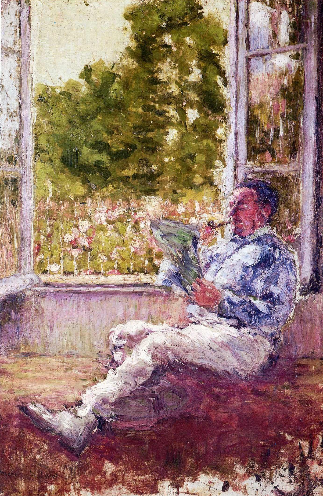

## 基本信息

- 作者：[[杜尚 Marcel Duchamp]]
- 创作年代：1907
- 材质：油画 (*not from wiki*)
- 尺寸：未知
- 现存地：未知 (*not from wiki*)

## 画面与技法

本讲（088）作为杜尚 1905 后**坚持 [[野兽派 Fauvism]] 手法**的代表出场——[[马蒂斯 Henri Matisse]] 1908 之后自己都放弃了野兽派画法，但杜尚一直坚持。

与马蒂斯的关键差异（顾衡判词）：**杜尚不把空间压缩成完全平面，而是保留了 [[马奈 Édouard Manet]] 式的浅空间** —— 这种"野兽派 + 浅空间"的混搭风格"显示出了杜尚的犹豫"——他还在五花八门的各个流派中"有一搭没一搭"的小心尝试。

## 历史背景

(*not from wiki*) 杜尚 1904 巴黎美院落榜后转走 [[波希米亚风 Bohemian Style]] 时期作品；1905 [[秋季沙龙展 Salon d'Automne]] 野兽派"野兽笼"事件后两年所作。

## 图片清单

| 编号 | 出自 | 描述 |
|---|---|---|
| 01 | [[088｜杜尚1：他"好好画画"是什么样子的？]] | 整体图——野兽派+马奈式浅空间混搭 |

## 出现在

- [[088｜杜尚1：他"好好画画"是什么样子的？]]
