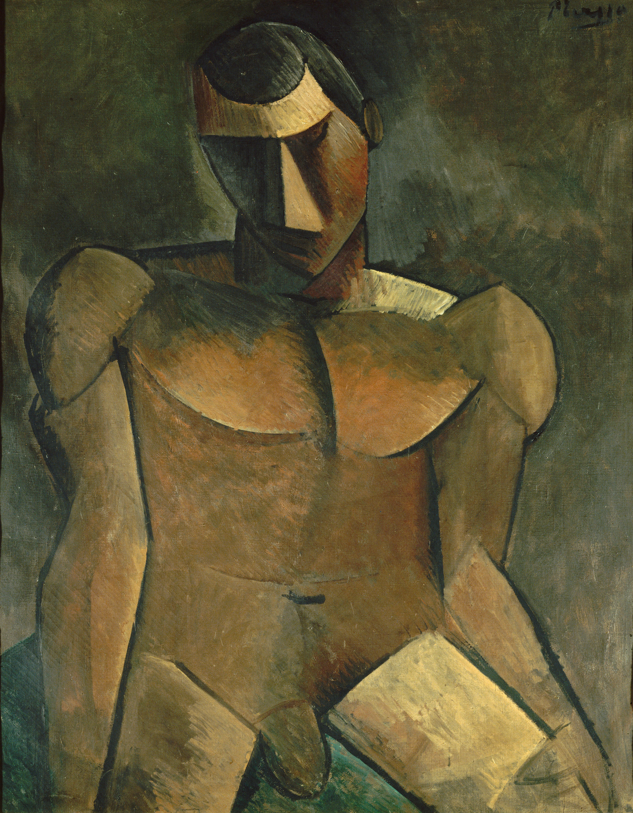

## 基本信息

- 作者：[[毕加索 Pablo Picasso]]
- 创作年代：1909
- 材质：布面油画 (*not from wiki*)
- 尺寸：约 92 × 73 cm (*not from wiki*)
- 现存地：巴黎现代艺术博物馆 (Centre Pompidou) (*not from wiki*)

## 画面与技法

毕加索 1909 年绘制的男性裸体。与勃拉克 1908 年《[[裸女 (勃拉克 1908) Big Nude|裸女]]》**风格高度雷同**——身体压扁、棱角化、几何切面拼贴；与同期的几何风景一起，构成两人深度协作的**早期立体主义证据**。

顾衡指出："不仅是风景，连人体也是风格高度雷同。"

## 历史背景 (*not from wiki*)

被视为毕加索从黑人时期向分析立体主义过渡阶段的代表作之一。

## 图片清单

| 编号 | 出自 | 描述 |
|---|---|---|
| 01 | [[068｜立体主义，除了毕加索还值得了解什么？]] | 与勃拉克《裸女》配对呈现的早期立体主义裸体 |

## 出现在

- [[068｜立体主义，除了毕加索还值得了解什么？]] —— 与勃拉克 1908《裸女》风格雷同的证据
