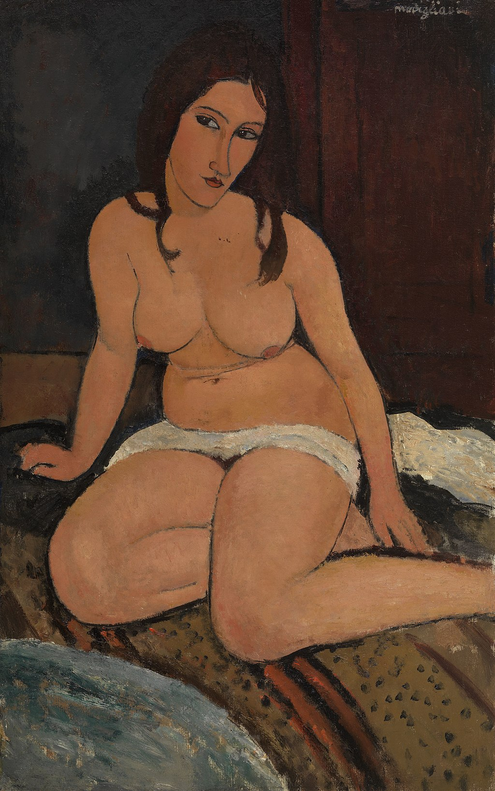

## 基本信息

- 作者：[[莫迪里阿尼 Amedeo Modigliani]]
- 创作年代：1917
- 材质：布面油画 (*not from wiki*)
- 尺寸：约 92 × 60 cm (*not from wiki*)
- 现存地：(*未知；多版本散布欧美*) (*not from wiki*)

## 画面与技法

[[莫迪里阿尼 Amedeo Modigliani]] 1917 年裸体画系列。**高度程式化**——长颈、椭圆头、低俯目光、肤色单一暖橙。顾衡 078 把这一组与同年的 [[坐在沙发毯上的裸女 (莫迪里阿尼) Nude Sitting on Divan Throw Blanket]]、[[戴项链坐着的裸女 (莫迪里阿尼) Seated Nude with Necklace]] 一起作为"**画的是女人而非某一个女人**"的范本。

## 历史背景 (*not from wiki*)

属 1917 年 Berthe Weill 画廊个展系列；展览开幕即被警方勒令撤展。

## 图片清单

| 编号 | 出自 | 描述 |
|---|---|---|
| 01 | [[078｜莫迪里阿尼：画中女子为什么让人一眼难忘？]] | 坐姿裸女 |

## 出现在

- [[078｜莫迪里阿尼：画中女子为什么让人一眼难忘？]]
