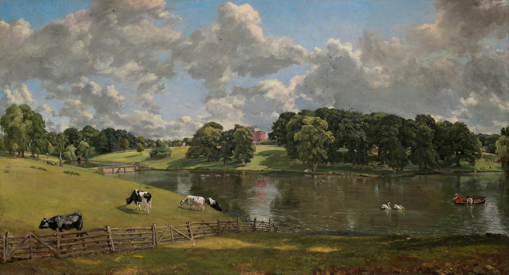

## 基本信息

- 作者：[[康斯泰布尔 John Constable]]
- 创作年代：1816
- 材质：布面油画 (*not from wiki*)
- 尺寸：56.1 × 101.2 cm (*not from wiki*)
- 现存地：华盛顿国家美术馆 (National Gallery of Art, Washington D.C.) (*not from wiki*)

## 画面与技法

**横长构图**——典型英国田园：

- 前景：草地 / 一片树丛 / 几只乳牛
- 中景：**威文荷公园的湖泊**——一艘小舟 / 几只天鹅
- 远景：**Rebow 家族的乡村庄园**主楼——红砖白窗、英国乔治时代建筑
- 天空：占画面**40% 以上**——典型英国变幻多云

**顾衡 037 重点**：

- 顾衡用本作作为**风景画取得最高成就**的代表
- **风景本身已经成为绘画的目的和主题**——这里不再有神话、不再有圣经，**只有英国乡村本身**
- 顾衡引康斯泰布尔致友人信："**从水闸流出来的水声、柳树、毁坏的木头、泥泞的标杆和磨坊，我热爱这一切，这些才使我成为一名画家**"——主体情感对客观景物的**深度投射**已经清晰

**形式上**：

- **湿润、明亮、空气感**——康斯泰布尔标志的"英国湿气"
- **不用任何符号、不靠任何故事**——纯靠**对真实地点的爱**支撑画面（与 [[象征时期风景 Symbolic Landscape]] 形成完整对照）

## 历史背景

(*not from wiki*) 1816 年由威文荷公园主人 Major-General Francis Slater-Rebow 委托康斯泰布尔为自家庄园作肖像画。康斯泰布尔在画里写信抱怨："这片公园太美了，我快忙不过来"——他不得不**把画布加宽 12 英寸**才把整个景色装下。1942 年由华盛顿国家美术馆购入。

## 图片清单

| 编号 | 出自 | 描述 |
|---|---|---|
| 01 | [[037｜为什么说古典时代没有风景画？]] | 整体图（英国乡村庄园全景） |

## 出现在

- [[037｜为什么说古典时代没有风景画？]]
