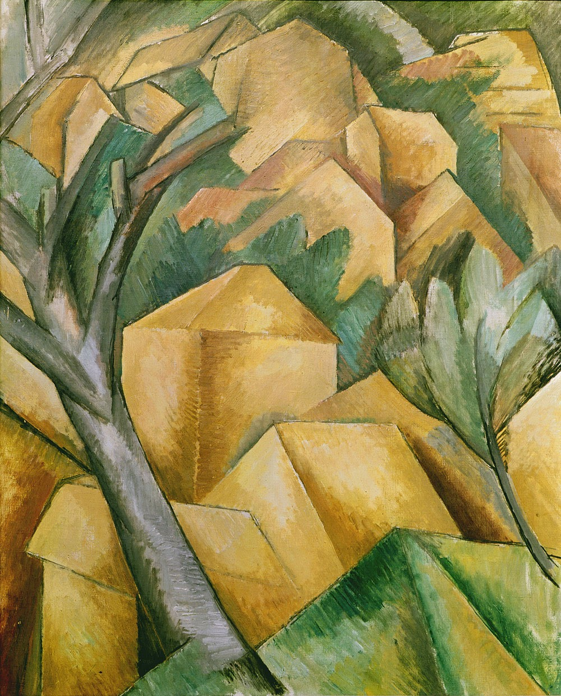

## 基本信息

- 作者：[[勃拉克 Georges Braque]]
- 创作年代：1908
- 材质：布面油画 (*not from wiki*)
- 尺寸：73 × 60 cm (*not from wiki*)
- 现存地：伯尔尼美术馆 (Kunstmuseum Bern) (*not from wiki*)

## 画面与技法

勃拉克 1908 年夏在马赛附近的**埃斯塔克 (L'Estaque)**——[[塞尚 Paul Cézanne]] 晚年常去画风景之地——创作的一批风景画之一。把房屋、树木**全部压扁、几何化为立方体堆叠**，色彩去饱和、走灰绿土黄；近乎放弃景深与大气透视。

这批画送到 1908 年秋季沙龙时，评委 [[马蒂斯 Henri Matisse]] 吐槽："**这就是一些小方块呀！**"评论家 [[瓦克塞尔 Louis Vauxcelles]] 则在评论里写："勃拉克把一切都浓缩在立方体之中了。"——**[[立体主义 Cubism]] 这个画派名由此而来**。

## 历史背景 (*not from wiki*)

这批 L'Estaque 风景画展时被秋季沙龙评委会拒了两幅（六幅只接受四幅），勃拉克一气之下全部撤回，转头与 [[毕加索 Pablo Picasso]] 投入分析立体主义。本组画因此被视为立体主义的**直接诞生点**。

## 图片清单

| 编号 | 出自 | 描述 |
|---|---|---|
| 01 | [[068｜立体主义，除了毕加索还值得了解什么？]] | 房屋堆叠为几何立方体的风景画 |

## 出现在

- [[068｜立体主义，除了毕加索还值得了解什么？]] —— 立体主义画派名的来源
