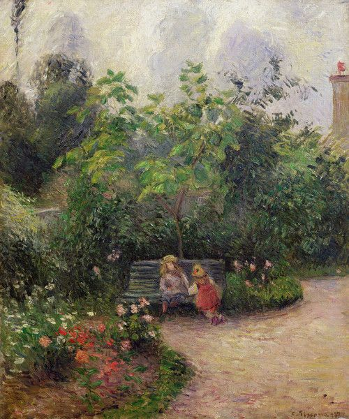

## 基本信息

- 作者：[[毕沙罗 Camille Pissarro]]
- 创作年代：1877
- 材质：布面油画 (*not from wiki*)
- 尺寸：54.5 × 65.5 cm (*not from wiki*)
- 现存地：(*not from wiki*) 流转中，曾归 Sammlung Hahnloser 等收藏

## 画面与技法（顾衡 044 解读）

[[毕沙罗 Camille Pissarro]] 风格的范本作品——**大面积的黄和绿**与**前景的红花和小姑娘的红衣服**形成**"有节制的对比"**。顾衡 044 解读：

- 毕沙罗**不允许红色抢戏**——通过"红中掺黄、绿中掺红"互相呼应来软化最强互补色对比；
- **画面重点保留在从明亮的树梢到长凳后阴影的一系列细腻明暗过渡上**——这是毕沙罗最终保留下来的 [[柯罗 Camille Corot]] 色调遗产；
- 综合效果："营造出母女二人在午后阳光下无所事事的甜蜜"。

## 在课程中的角色

**顾衡 044 个人最爱的毕沙罗作品**——课程明文："**这是毕沙罗作品中我最喜欢的一幅。**" 044 用它作为毕沙罗"温和细腻"调色技巧的最纯净样本。

## 图片清单

| 编号 | 出自 | 描述 |
|---|---|---|
| 01 | [[044｜莫利索和毕沙罗：最纯正的印象派什么样？]] | 全画 |

## 出现在

- [[044｜莫利索和毕沙罗：最纯正的印象派什么样？]] —— 顾衡个人最爱的毕沙罗作品
- [[毕沙罗 Camille Pissarro]] —— 代表作之一
