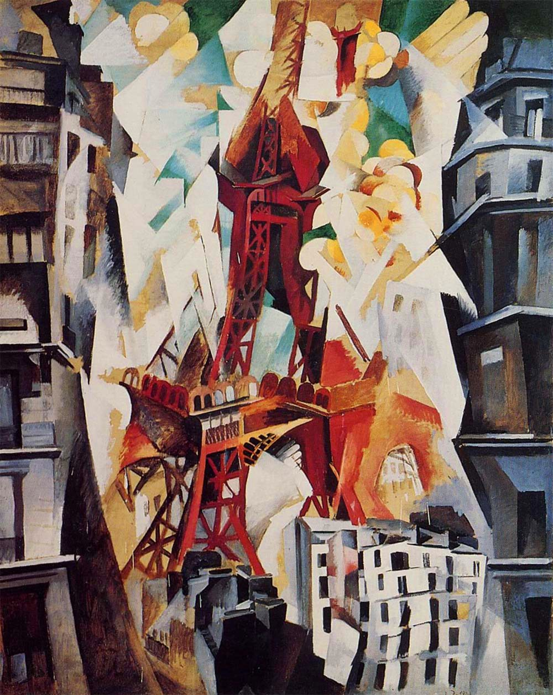

## 基本信息

- 作者：[[德劳内 Robert Delaunay]]
- 创作年代：1911
- 材质：布面油画 (*not from wiki*)
- 尺寸：约 195 × 129 cm (*not from wiki*)
- 现存地：所罗门·R·古根海姆博物馆 (Guggenheim, 纽约) (*not from wiki*)

## 画面与技法

德劳内**埃菲尔铁塔组画**的关键一幅。把这座 1889 年世博会建造的钢铁地标**从底部、侧面、空中**多角度同时压缩到一张画布——铁塔身被几何切片碎裂，仿佛被多束光从不同方向同时砸碎；周围的奥斯曼街区建筑也按几何块面破碎重组。

体现了德劳内自创的 **"[[同时性绘画 Simultaneous Paintings|同时性 (simultanéité)]]"** 理念——音乐里的音符必须依次出场，绘画却可以**在同一画布上同时呈现多种颜色和多个视角**。

## 历史背景 (*not from wiki*)

德劳内 1909–1928 年间画了**30 多件**埃菲尔铁塔母题作品；本 1911 版是早期最暴力、最破碎的一幅，**也是 20 世纪现代主义"破碎重构都市意象"的源头之一**。直接影响了立体未来主义、奥菲尔派 (Orphism)、以及后来的城市主题摄影。

## 图片清单

| 编号 | 出自 | 描述 |
|---|---|---|
| 01 | [[068｜立体主义，除了毕加索还值得了解什么？]] | 多视角破碎的铁塔与奥斯曼街区 |

## 出现在

- [[068｜立体主义，除了毕加索还值得了解什么？]] —— "同时性绘画"代表作
