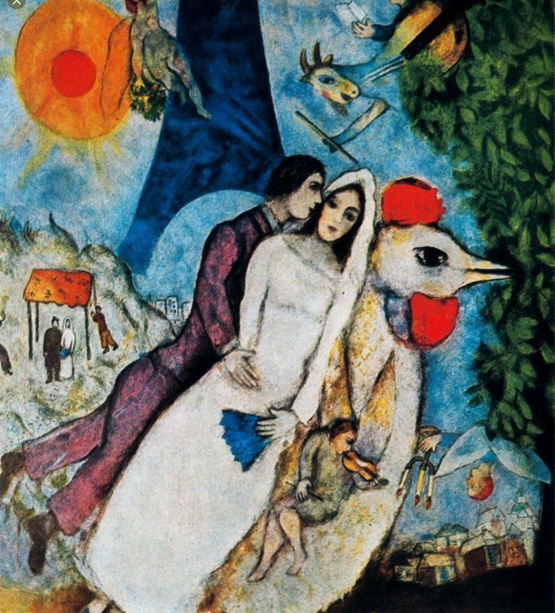

## 基本信息

- 作者：[[夏加尔 Marc Chagall]]
- 模特：[[贝拉·罗森菲尔德 Bella Rosenfeld]]
- 创作年代：1938–1939
- 材质：布面油画 (*not from wiki*)
- 尺寸：约 150 × 136.5 cm (*not from wiki*)
- 现存地：巴黎蓬皮杜艺术中心 (Centre Pompidou) (*not from wiki*)

## 画面与技法

夏加尔晚期"贝拉肖像组"代表作之一。**埃菲尔铁塔** + 维切布斯克农舍 + 漂浮新娘 + 公鸡 + 月亮等夏加尔标志母题的**总汇**——巴黎与故乡两个空间被同时叠加在一张画面里。

顾衡 077 把它和 [[斜躺的诗人 The Reclining Poet]] 一起，作为夏加尔**终身不停描绘"村子、农舍和牲口"**的范例：

> "**即使在定居海外多年之后，夏加尔也还是不停地描绘他的村子、农舍和牲口。他说：'我熟悉的就是教堂、篱笆、店铺和犹太人的聚会。'**"

## 历史背景 (*not from wiki*)

1938–1939 年作，二战前夕。一年后（1941）夏加尔夫妇被迫流亡美国。这幅画凝固了战前夏加尔在巴黎的最后片刻——埃菲尔铁塔与维切布斯克并置，是流亡前的"完整夏加尔世界"。

## 图片清单

| 编号 | 出自 | 描述 |
|---|---|---|
| 01 | [[077｜夏加尔：俄国人在巴黎]] | 铁塔 + 农舍 + 漂浮新娘 + 公鸡的总汇构图 |

## 出现在

- [[077｜夏加尔：俄国人在巴黎]] —— 故乡 + 巴黎双重空间叠加；贝拉肖像组代表作
