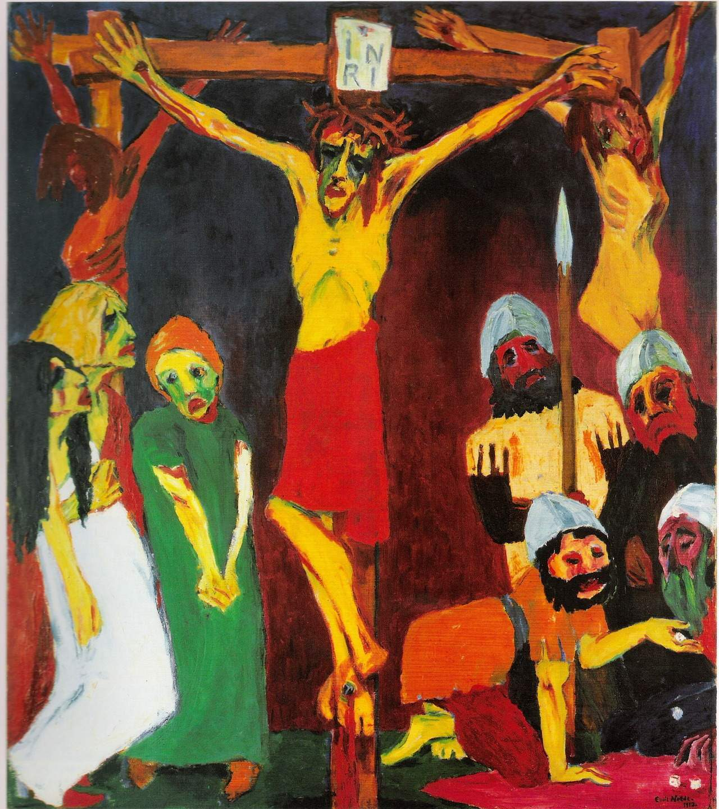

## 基本信息

- **作者**：[[诺尔德 Emil Nolde]]
- **创作年代**：1912
- **材质**：布面油画——九联画祭坛形式 (*not from wiki*)
- **尺寸**：中央板 220.5 × 193.5 cm；侧板 8 件各 100 × 86 cm (*not from wiki*)
- **现存地**：诺尔德基金会 Nolde Stiftung Seebüll (*not from wiki*)

## 画面与技法

- 072 与 [[秋天的海 (诺尔德) Autumn Sea]]、[[面具 (诺尔德) Mask Still Life III]] 同组——作为诺尔德"综合期"代表，**凡·高+马蒂斯、毕加索+高更**式混搭风格的范例。
- **顾衡用的题名是"基督上十字架"，但 raw caption 给出的英文是 *The Life of Christ*（基督生平）**——实际为九联画完整组件中的一幅或整组的笼统称呼；按 raw 同时保留双语 (*not from wiki* 实为基督生平九联画系列)。

## 历史背景 (*not from wiki*)

1911–1912 诺尔德宗教题材高峰——**充满宗教狂想**的他对耶稣生平的演绎深受 [[高更 Paul Gauguin]] 大溪地宗教画的形简化与 [[凡·高 Vincent van Gogh]] 笔触的双重影响。

## 图片清单

| 编号 | 出自 | 描述 |
|---|---|---|
| 01 | [[072｜桥社：什么是表现主义绘画的使命？]] | The Life of Christ 1912 — 综合期宗教题材 |

## 出现在

- [[072｜桥社：什么是表现主义绘画的使命？]]
