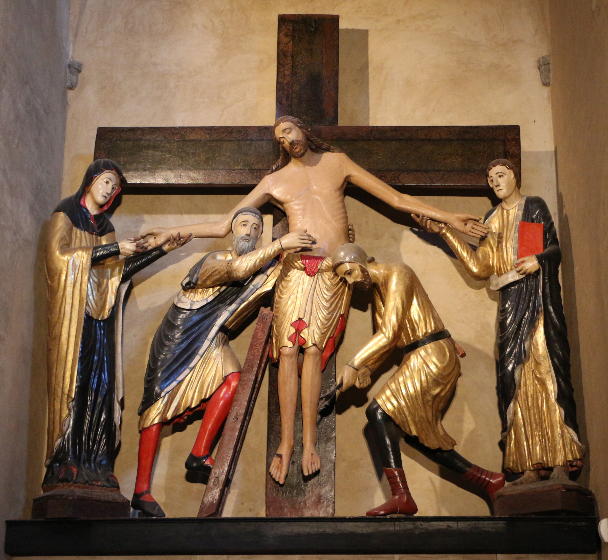

## 基本信息

- 作者：匿名 13 世纪意大利雕刻师（曾归 Maestro di Volterra）
- 创作年代：1228 (*not from wiki*)
- 材质：彩绘木雕群像 (polychrome wood) (*not from wiki*)
- 尺寸：真人尺寸 (*not from wiki*)
- 现存地：意大利沃拉泰拉主教座堂 (Duomo di Volterra)

## 画面与技法

多人物群像。中央**基督已被解下、身体侧倾向圣母玛利亚**；圣母伸手承接；约瑟·尼科底母在一侧扶着；圣约翰、抹大拉的玛利亚等围绕。木雕原本通体彩绘，今多有褪色与重绘。

形式特征：

- **强烈悲情**——基督的死亡瞬间被定格在最痛苦的状态；
- **写实身体**——基督的肌肉、骨架、手脚已不是拜占庭式平面化，能看出对解剖的关注；
- **动态构图**——人物不是正面对称排列，而是有动作、有相互倚靠。

## 历史背景

(*not from wiki*) 13 世纪意大利已经在哥特艺术北方影响下走向写实，本作是较早的群像彩雕例证。

顾衡在 [[005｜哥特艺术1：为什么说它是文艺复兴的前奏？]] 用它作为欧洲教会"特别偏爱渲染悲苦的题材"的代表：拜占庭岁月静好画圣母子，欧洲苦出身教会要拉香火，钉刑、下架、圣殇成了所有教堂的标配。**对悲情的渲染需要写实**——这是欧洲中世纪绘画埋下写实种子的关键。

## 图片清单

| 编号 | 出自 | 描述 |
|---|---|---|
| 01 | [[005｜哥特艺术1：为什么说它是文艺复兴的前奏？]] | 整体图 |

## 出现在

- [[005｜哥特艺术1：为什么说它是文艺复兴的前奏？]]
