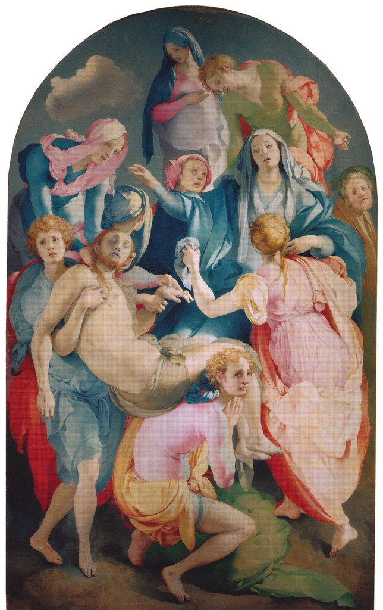

## 基本信息

- 作者：[[蓬托尔莫 Jacopo da Pontormo]]
- 创作年代：1526–1528
- 材质：板上油画 (*not from wiki*)
- 尺寸：313 × 192 cm (*not from wiki*)
- 现存地：佛罗伦萨圣费利奇塔教堂卡波尼礼拜堂 (Cappella Capponi, Santa Felicita, Firenze) (*not from wiki*)

## 画面与技法

[[矫饰主义 Mannerism]] 代表作之一。约 11 个人物挤作一团，将刚卸下十字架的基督向画面下方传递——但画家**完全没画十字架**，甚至**连个梯子都懒得画**：那这几个人究竟是怎么爬上去的？对矫饰主义画家来说**这是个蠢问题**——他们必须爬上去，因为这样才有形式美感，足矣。

形式特征：

- **拒斥叙事逻辑**——空间、动作、因果都让位于形式编排。
- **极其鲜艳的色彩**——粉、绿、橘、蓝拼接，**几乎不真实**，曾被学者用来证明它"堕落"、不同于米开朗基罗的"含蓄用色"。
- **强烈动感、凹造型**——所有人物呈悬空姿态，重心不落地，形成漂浮的椭圆。
- **没有黑色阴影**——脸庞、衣袍均匀打光；高纯度色块直接拼接。

## 历史背景

(*not from wiki*) 卡波尼家族委托。**关键学术翻案**：长期被引为"蓬托尔莫色彩堕落 vs 米开朗基罗用色含蓄"对照——直到 **1989 年意大利政府清洗西斯廷天顶画**：500 年累积的烟煤洗掉后，**米开朗基罗的用色与蓬托尔莫不是接近，而是一模一样**。本作**就是一幅向米开朗基罗的致敬之作**。

这一发现**啪啪打脸了**旧叙事——也成为 **达尼埃尔·阿拉斯** 等新一代艺术史学者把"矫饰主义"重新定义为"**就是米开朗基罗的绘画**"的关键证据。

## 图片清单

| 编号 | 出自 | 描述 |
|---|---|---|
| 01 | [[018｜矫饰主义：过度追求形式有什么后果？]] | 整体图 |
| 02 | [[018｜矫饰主义：过度追求形式有什么后果？]] | 局部：基督下半身被多人托举 |

## 出现在

- [[018｜矫饰主义：过度追求形式有什么后果？]]
