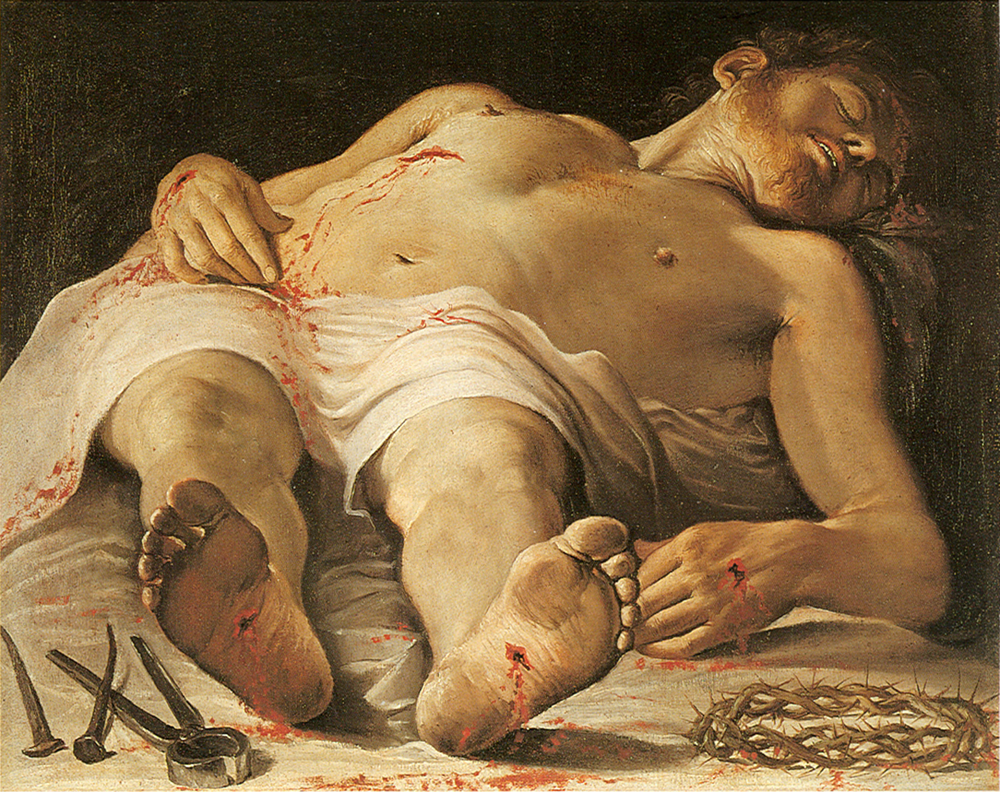

## 基本信息

- 作者：[[卡拉齐 Annibale Carracci]]
- 创作年代：1583–1585
- 材质：布面油画 (*not from wiki*)
- 尺寸：71 × 89 cm (*not from wiki*)
- 现存地：德国斯图加特国立美术馆 (Staatsgalerie Stuttgart) (*not from wiki*)

## 画面与技法

死去的基督身体**顺着画面深度方向竖着躺**——脚丫子正对观众，从画面前景指向画面深处。**纵深叙事的极端化**——[[沃尔夫林 Heinrich Wölfflin]] **"平面 vs 纵深"**的标志性视觉证据。

**顾衡 022**：与 [[圣母之死 (卡拉瓦乔) The Death of the Virgin]] 并列——
> "为了让人竖着躺，一个避免不了的后果就是脚丫子得正对着观众。但即使如此，[[巴洛克 Baroque]] 画家也不肯把人转 90°。"

**与曼特尼亚的早先版本的关系**（*not from wiki*）：[[曼特尼亚 Andrea Mantegna]] 1480 年前后已画过 *Lamentation of Christ* 用过同样的脚丫子正对观众的短缩法构图——但曼特尼亚是"为了显示自己的技法"，卡拉齐是"为了纵深叙事"——同一画面手法在不同的方法论框架下被复用。

## 历史背景

(*not from wiki*) 卡拉齐与堂兄 Lodovico Carracci、兄长 Agostino Carracci 共同创立博洛尼亚学院，本作是其早期作品。

## 图片清单

| 编号 | 出自 | 描述 |
|---|---|---|
| 01 | [[022｜巴洛克：华丽等于没内涵吗？]] | 整体图（纵深叙事极端化） |

## 出现在

- [[022｜巴洛克：华丽等于没内涵吗？]]（沃尔夫林"平面 vs 纵深"参数的标志性视觉证据）
