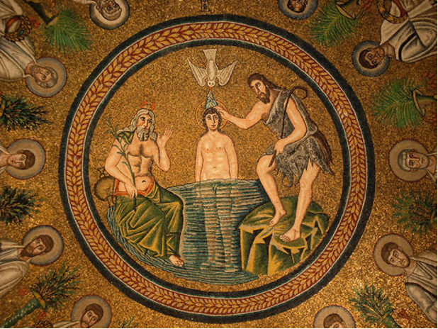

## 基本信息

- 作者：匿名拜占庭镶嵌师
- 创作年代：约 490 (*not from wiki*)
- 材质：天顶圆形 [[马赛克 Mosaic]] (*not from wiki*)
- 尺寸：(*not from wiki*) 直径数米的圆形天顶
- 现存地：意大利拉文纳阿利亚诺洗礼堂 (Battistero degli Ariani, Ravenna) (*not from wiki*)

## 画面与技法

圆形天顶画。中央描绘基督受洗：

- **中**：基督裸身立于约旦河水中；
- **右**：施洗者约翰从河岸高处用贝壳把水浇向基督的头；
- **左**：一位长须老者（约旦河河神，希腊化遗存）半裸而坐，象征"河"被人格化；
- **顶**：一只白鸽（圣灵）从上方降下。

围绕中央圆心，**十二门徒**呈环形列队，各执花冠。

构图的关键巧思——顾衡指出：**人物是平视的，河水却是俯视的**。这种"同一画面里多视角拼贴"承袭古埃及的多角度组合（参见 [[正身侧面律 Composite View]]），脱离了希腊式的统一视点。

## 历史背景

(*not from wiki*) 这一洗礼堂由东哥特阿利乌斯派国王西奥多里克所建，圆形天顶画完成于 5 世纪末。是早期拜占庭风格在意大利的代表作之一。

顾衡在 [[004｜拜占庭艺术：程式化的艺术是怎么回事？]] 用它论证：拜占庭艺术**吸纳东方（古埃及）的多视角程式**——这与拜占庭艺术的另一个特征"高度程式化"互相加强。

## 图片清单

| 编号 | 出自 | 描述 |
|---|---|---|
| 01 | [[004｜拜占庭艺术：程式化的艺术是怎么回事？]] | 整体图 |

## 出现在

- [[004｜拜占庭艺术：程式化的艺术是怎么回事？]]
