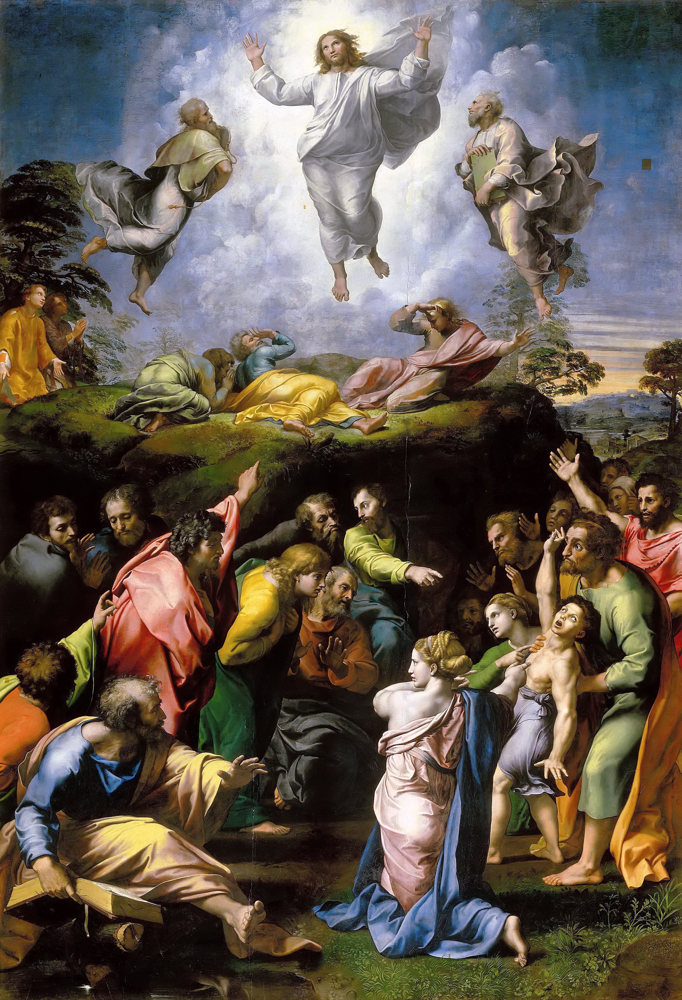

## 基本信息

- 作者：[[拉斐尔 Raphael]] (与工作室助手合作，未完成时拉斐尔去世，1520 由 Giulio Romano 完成下半部分) (*not from wiki*)
- 创作年代：1516/1518–1520 (顾衡引"1518–1520") (*not from wiki*)
- 材质：木板蛋彩 (后转布)
- 尺寸：405 × 278 cm (*not from wiki*)
- 现存地：梵蒂冈博物馆 Pinacoteca Vaticana

## 画面与技法

画面**上下两部分形成强烈对比**：

- **上半**：基督在塔波山顶变形，悬浮在金光中；左右两侧分别是先知摩西与以利亚；下方三位门徒（彼得、雅各、约翰）被光震慑跌倒；
- **下半**：一群人围着一个**被恶魔附身的少年**，焦急地等待基督下山救治；他们激动地手指上方、互相争论；
- **舞台剧式布光**：上方亮、下方暗；上方平静、下方激动；
- **人物充满紧张而扭曲的动感**——与拉斐尔之前圣母系列那种**恬静优雅完全不同**。

顾衡 013："拉斐尔之前的宗教作品都是以恬静优雅为特征……可是这幅《基督变容》却与他以前的作品大异其趣，人物充满了紧张而扭曲的动感，画面的布光也呈现出舞台剧的夸张感。"

## 历史背景

(*not from wiki*) 1517 年法国国王弗朗索瓦一世任命**朱利奥·美第奇** (后来的教皇克莱芒七世) 为法国纳博讷大教堂的主教。朱利奥想为其教堂画祭坛画，**同时向威尼斯画派的 Sebastiano del Piombo (皮翁博) 和拉斐尔下订单——让他俩竞争**。

本来拉斐尔没把订单放心上 (他是利奥十世红人，区区红衣主教订单何须竞争上岗)。**但听说 Piombo 请了 [[米开朗基罗 Michelangelo]] 帮忙构图后，拉斐尔的好胜心被激发**——他要"**用米开朗基罗的手法打败米开朗基罗**"——于是把《基督变容》画成了从未有过的扭曲动感样式。

拉斐尔 1520 年 4 月 6 日去世（37 岁生日当天），画未完成。教皇利奥十世让 Giulio Romano 完成下半部分。葬礼上，**这幅未完成的画就挂在拉斐尔的灵柩头顶**——成为他的告别作。

后世评价：被认为是**矫饰主义 (Mannerism) 与巴洛克的先声** (*not from wiki*)——人物扭曲、激情戏剧化、上下分割明暗对比，都是后两个流派的标志。

## 图片清单

| 编号 | 出自 | 描述 |
|---|---|---|
| 01 | [[013｜恩怨：文艺复兴三杰如何相互影响？]] | 整体图 |

## 出现在

- [[013｜恩怨：文艺复兴三杰如何相互影响？]]
