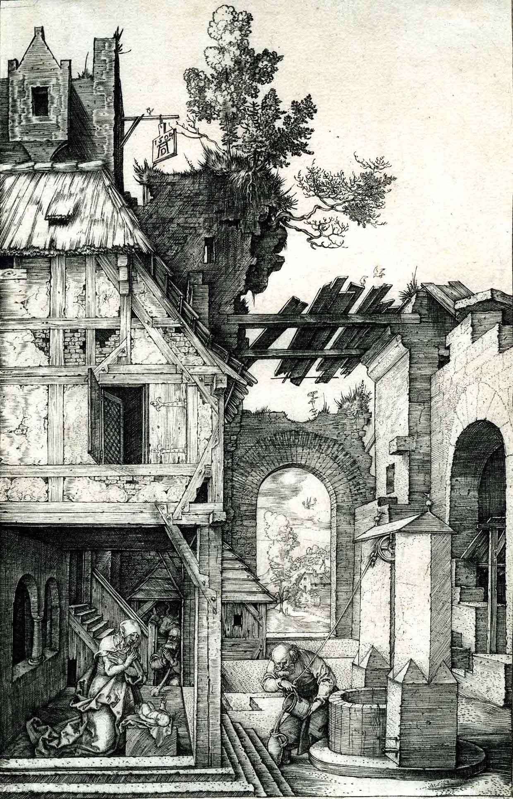
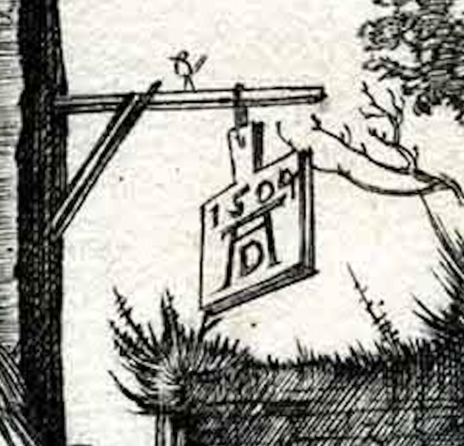

## 基本信息

- 作者：[[丢勒 Albrecht Dürer]]
- 创作年代：1504
- 材质：[[铜版画 Engraving]] (*not from wiki*：本课未注明制版方式，依据丢勒 1504 年"小受难 Engravings"系列推断)
- 尺寸：约 18.5 × 12 cm (*not from wiki*)
- 现存地：多份印本 (*not from wiki*)

## 画面与技法

[[丢勒 Albrecht Dürer]] 借鉴 [[曼特尼亚 Andrea Mantegna]] **建筑舞台式构图**的代表——主题"基督诞生"被处理得极为**平淡日常**：

- 圣母向新生的耶稣行跪拜礼
- 丈夫约瑟在井边**专心致志地朝细口瓶里倒水**（最日常的家务）
- 天使画得几乎看不见
- 朝拜的牧羊人**藏在楼梯口的阴影里**

顾衡评论："把这个神圣的时刻融化在日常的平淡中。而正是这份平淡，让人深受感动。"

**画中签名（最早的版权声明）**：丢勒把自己的字母签名画在**二楼窗外一面飘扬的旗子上**——因版画极易被盗，他专门为自己设计了这个特殊签名。

## 历史背景 (*not from wiki*)

这幅画引出了丢勒诉 [[拉伊蒙迪 Marcantonio Raimondi]] 案——拉伊蒙迪把丢勒 74 幅木刻版画翻成铜版画大卖。丢勒亲赴威尼斯打官司，**法院判决禁止拉伊蒙迪在翻版上署名**——是西方艺术史早期版权意识的标志性案件。

## 图片清单

| 编号 | 出自 | 描述 |
|---|---|---|
| 01 | [[020｜丢勒：为什么版画那么重要？]] | 全图 |
| 02 | [[020｜丢勒：为什么版画那么重要？]] | 局部——二楼旗子上的丢勒签名 |

## 出现在

- [[020｜丢勒：为什么版画那么重要？]]
