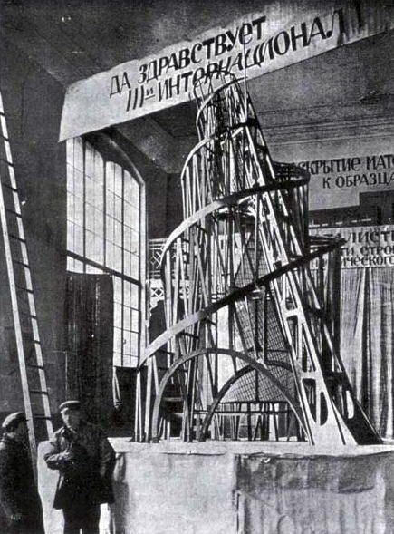

## 基本信息

- 作者：[[塔特林 Vladimir Tatlin]]
- 创作年代：1919–1920（设计稿与模型）
- 材质：钢、玻璃（设计预想）；展出模型为木、铁、绳索 (*not from wiki*)
- 尺寸：拟建 450 米；展出模型 5 米 (*not from wiki*)
- 现存地：从未实际建成；原模型遗失，复原模型存于俄罗斯博物馆、莫斯科特列季亚科夫画廊、瑞典摩纳俱乐部等 (*not from wiki*)

## 画面与技法

[[构成主义 Constructivism]] 美学的纪念碑级宣言——拟建 450 米高（比埃菲尔铁塔高出整整一半），是塔特林为**第三共产国际**总部设计的螺旋钢架结构。

塔特林自述（顾衡 086 引）："**物质的运动与张力、艺术与实用的结合，以及现代科技的运用**。"——这是构成主义的纲领性陈述。

按设计，塔内嵌四个不同速率旋转的几何体（立方体年转 1 周作为立法机关、棱锥月转 1 周作为行政机关、圆柱体日转 1 周作为新闻信息中枢、半球小时转 1 周作为电报站）——把**社会运转节律物化为机械几何的运动**。

## 历史背景 (*not from wiki*)

1919 年人民启蒙委员会委托塔特林设计第三国际纪念碑——但红白两军内战正酣、苏维埃肚子都填不饱（顾衡 086 原话："年轻的苏维埃肚子都填不饱"）——塔特林塔最终未建成。

塔特林塔成为**构成主义乌托邦冲动的代名词**——既体现 [[构成主义 Constructivism]] "艺术为革命服务、艺术与实用结合、用现代科技重塑社会"的全部信念，也象征其**在物质匮乏的现实面前必然落空**的命运。

塔特林本人也崇拜泰勒的管理学，"希望整个社会都能像一台机器一样运转，去除一切人性中含混的、矛盾的和没有效率的东西"（顾衡 086）。

## 图片清单

| 编号 | 出自 | 描述 |
|---|---|---|
| 01 | [[086｜塔特林：什么是构成主义？]] | 塔特林塔模型照片 |

## 出现在

- [[086｜塔特林：什么是构成主义？]]
