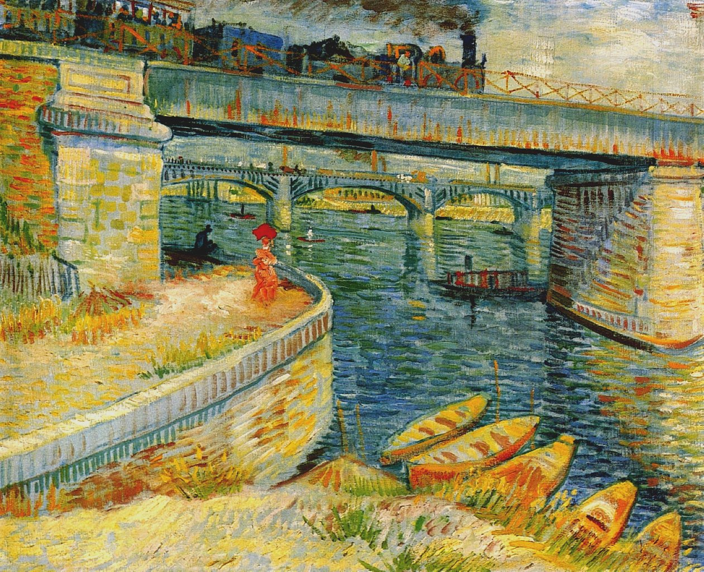

## 基本信息

- 作者：[[凡·高 Vincent van Gogh]]
- 创作年代：1887
- 材质：布面油画 (*not from wiki*)
- 尺寸：(*not from wiki*) 53.5 × 67 cm
- 现存地：(*not from wiki*) 苏黎世 E.G. Bührle 基金会

## 画面与技法

058 用以举证凡·高的**紫-黄补色配色**与浮世绘装饰性。1887 年凡·高仍在巴黎，常与 [[贝尔纳 Émile Bernard]]、[[修拉 Georges Seurat]] 等到塞纳河近郊的 Asnières（阿斯尼埃尔）写生——这一带也是 [[大碗岛的星期天下午 A Sunday Afternoon on the Island of La Grande Jatte]] 的取景地段。

凡·高在此画中已经把**黄色作为画面整体明度的主控**，紫色与之相对，构图大幅度简化、桥架线条干脆——浮世绘特征明显。

## 历史背景 (*not from wiki*)

Asnières-sur-Seine 是 19 世纪末巴黎西北郊的休闲区，紧邻大碗岛，是新印象主义画家集体写生的热门地段。1887 年凡·高与贝尔纳在那里搭过一个临时画室，凡·高的色彩与构图在这一时期发生第一次系统转变。

## 图片清单

| 编号 | 出自 | 描述 |
|---|---|---|
| 01 | [[058｜凡·高2：为什么他的风格难以界定？]] | 整幅画作，紫-黄补色 + 浮世绘风样本 |

## 出现在

- [[058｜凡·高2：为什么他的风格难以界定？]]
