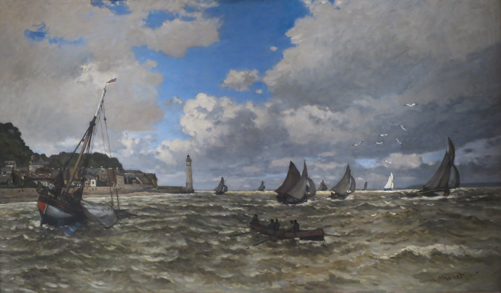

## 基本信息

- 作者：[[莫奈 Claude Monet]]
- 创作年代：1865（041 caption）
- 材质：布面油画 (*not from wiki*)
- 尺寸：(*not from wiki*)
- 现存地：(*not from wiki*) —— 一说洛杉矶诺顿西蒙博物馆 Norton Simon Museum

## 画面与技法

041 出现的莫奈早期海景画——**第一次入选 [[巴黎沙龙 Paris Salon]]** 的两幅作品之一（1865）。题材延续了 [[布丹 Eugène Boudin]] 海景路线，技法上**仍带 [[柯罗 Camille Corot]] 朦胧痕迹**——041 顾衡明示莫奈早期作品"极力模仿柯罗的痕迹也还是很明显……莫奈对柯罗的模仿，有急于获得沙龙承认的成份"。

## 历史背景

041 引《美术评论》杂志的评论："**莫奈先生的《塞纳河口》突然使我们停了下来，而我们永远不会忘记它，从此我们一定会对这位诚恳的海景画家以后的作品感到兴趣。**" —— 对第一次参加沙龙的年轻画家来说，这样的评价"喜从天降"。

(*not from wiki*) 翁弗勒尔 Honfleur 是诺曼底塞纳河出海口的港口小城——与勒阿弗尔隔河相望——是莫奈、布丹、约金（Jongkind）等户外画家的常去地。

## 图片清单

| 编号 | 出自 | 描述 |
|---|---|---|
| 01 | [[041｜莫奈1：颠覆式的创新从何而来？]] | 翁弗勒尔塞纳河出海口 |

## 出现在

- [[041｜莫奈1：颠覆式的创新从何而来？]]
