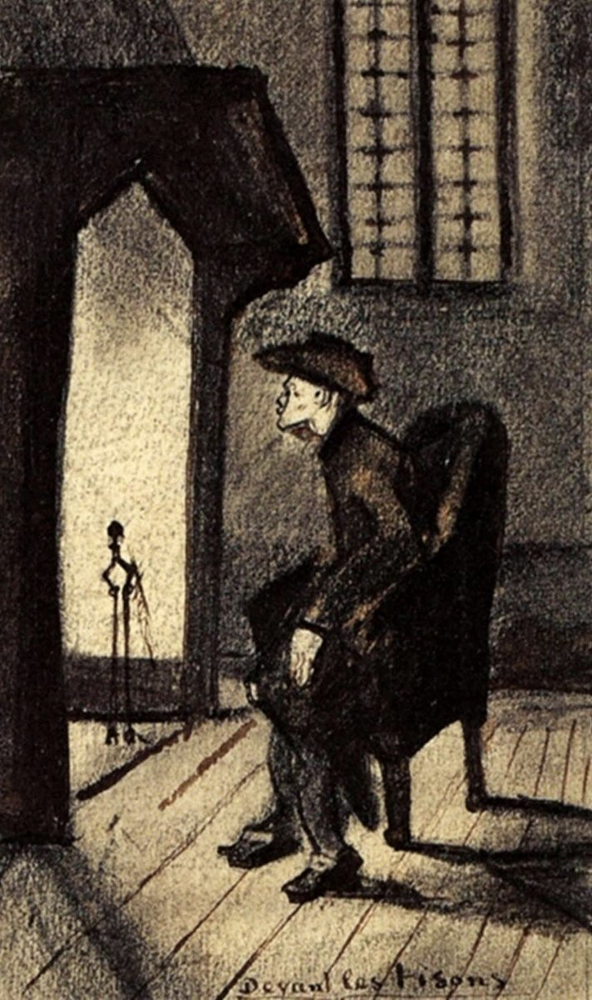

## 基本信息

- 作者：[[凡·高 Vincent van Gogh]]
- 创作年代：1881
- 材质：素描 (*not from wiki*)
- 尺寸：—
- 现存地：—

## 画面与技法

凡·高早期素描。057 中作为"接受提奥资助初期基本功仍粗糙"的例证出现。原文 caption 作"壁炉边"，正文行文一处作"壁炉前"。

## 历史背景 (*not from wiki*)

1881 年凡·高在荷兰埃滕（Etten）父母家、随后海牙起步阶段的素描母题之一——继续关注底层劳动者与农民生活的室内场景。

## 图片清单

| 编号 | 出自 | 描述 |
|---|---|---|
| 01 | [[057｜凡·高1：为什么说他"性格决定命运"？]] | 凡·高 1881 年素描《壁炉边》 |

## 出现在

- [[057｜凡·高1：为什么说他"性格决定命运"？]]
