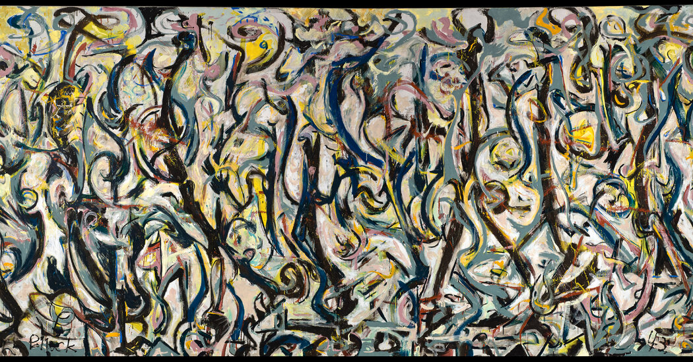

## 基本信息

- 作者：[[波洛克 Jackson Pollock]]
- 创作年代：1943
- 材质：(*not from wiki*；油画 + 酪蛋白涂料于画布)
- 尺寸：约 2.5 m × 6 m (*not from wiki*)
- 现存地：爱荷华大学斯坦利艺术博物馆 (*not from wiki*)

## 画面与技法

[[佩姬·古根海姆 Peggy Guggenheim]] 签约波洛克后立即委托的大壁画，画给佩姬自家门廊。"据说波洛克只用了一个晚上就画完了，当然是在喝了很多酒之后"——所以"显然就是一幅 [[超现实主义 Surrealism]] 自动创作"。

是波洛克进入大尺幅画布工作流的起点——为后来的 [[滴画法 Drip Painting]] 铺垫了"大画布 + 自动书写"的工艺逻辑。

## 历史背景 (*not from wiki*)

1943 年佩姬包装炒作波洛克的开局动作：媒体高曝光 + 委托重大单子 + 全力推。

## 图片清单

| 编号 | 出自 | 描述 |
|---|---|---|
| 01 | [[096｜波洛克：什么是当代艺术的第一个流派？]] | 壁画 Mural (1943) |

## 出现在

- [[096｜波洛克：什么是当代艺术的第一个流派？]]
