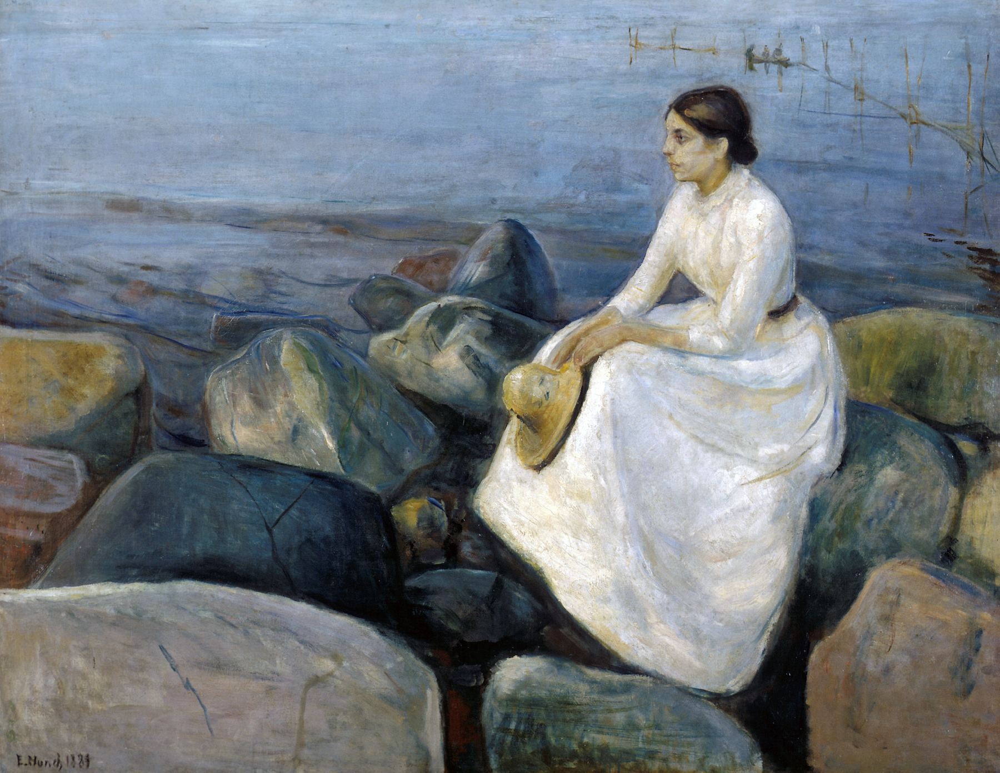

## 基本信息

- 作者：[[爱德华·蒙克 Edvard Munch]]
- 创作年代：1889
- 材质：布面油画 (*not from wiki*)
- 尺寸：未注明
- 现存地：卑尔根 KODE 美术馆 (*not from wiki*)

## 画面与技法

模特是蒙克的妹妹 **英格 (Inger)**。1886 年《[[病中的女孩儿 The Sick Child]]》在奥斯陆遭恶评，蒙克**有所退却**——本作与四年前那幅相比**回到了更加传统、更加学院派的风格**上去（顾衡 070）。

## 历史背景 (*not from wiki*)

1889 创作时蒙克尚未获官方奖学金赴巴黎；本作为他短暂"退回学院派"过渡期作品。同年下半年蒙克即得到奖学金、赴巴黎开启对其影响最深的法国游学。

## 图片清单

| 编号 | 出自 | 描述 |
|---|---|---|
| 01 | [[070｜蒙克1：表现主义的先行者经历了什么？]] | 妹妹英格海滩侧影 |

## 出现在

- [[070｜蒙克1：表现主义的先行者经历了什么？]]
