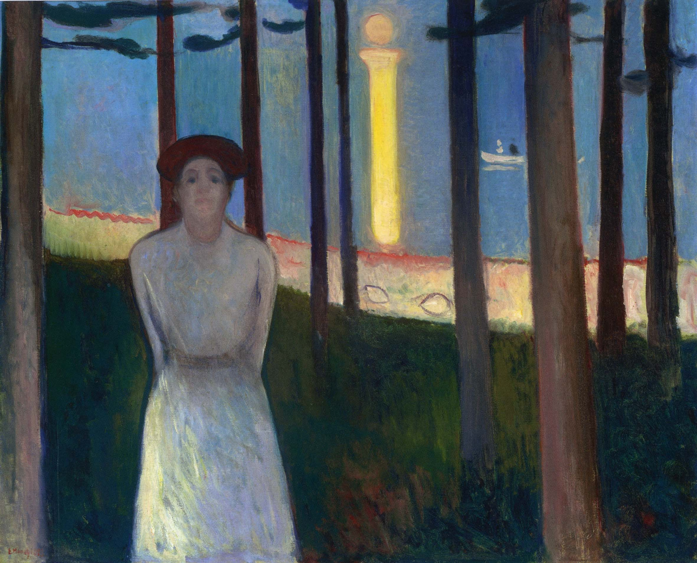

## 基本信息

- 作者：[[爱德华·蒙克 Edvard Munch]]
- 创作年代：1893
- 材质：布面油画 (*not from wiki*)
- 尺寸：约 88 × 110 cm (*not from wiki*)
- 现存地：波士顿美术博物馆 Museum of Fine Arts, Boston (*not from wiki*)

## 画面与技法

顾衡 [[071｜蒙克2：为什么他是表现主义之父？]] 把它与 [[海滩上的少女 Young Woman on the Beach]] 并举为蒙克 1895 年以前**受 [[夏凡纳 Puvis de Chavannes]] 影响显而易见**的作品——属 [[象征主义 Symbolism]] 阶段、**非** [[表现主义 Expressionism]]。

## 历史背景 (*not from wiki*)

亦称《声音》(The Voice / Stemmen)，是蒙克"生命的饰带" Frieze of Life 系列中关于**初识爱情**的画。林间挺立的少女、远处月柱倒映水面——是欲望初醒的视觉化。

## 图片清单

| 编号 | 出自 | 描述 |
|---|---|---|
| 01 | [[071｜蒙克2：为什么他是表现主义之父？]] | 林间少女正面 |

## 出现在

- [[071｜蒙克2：为什么他是表现主义之父？]]
