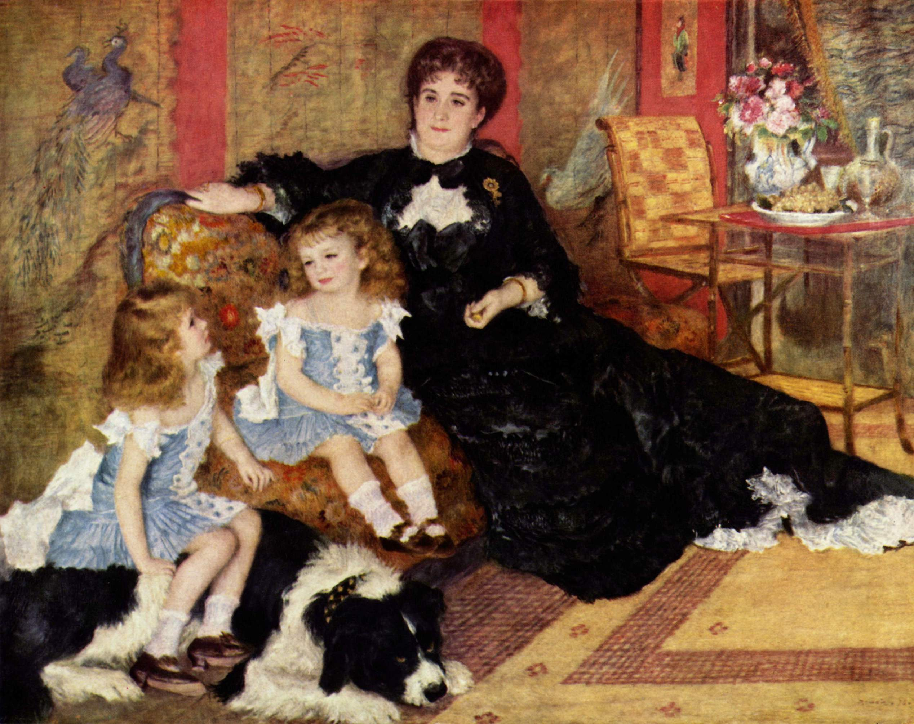

## 基本信息

- 作者：[[雷诺阿 Pierre-Auguste Renoir]]
- 创作年代：1876—1877（043 caption 标注；通常资料标 1878） (*not from wiki*)
- 材质：布面油画 (*not from wiki*)
- 尺寸：154 × 190 cm (*not from wiki*)
- 现存地：纽约大都会艺术博物馆 Metropolitan Museum of Art (*not from wiki*)

## 画面与技法

雷诺阿生涯的转折性作品。043 顾衡叙事链条：

- 1878 雷诺阿按**传统画法**画此作，**提交给官方沙龙**——并非印象派画展。
- 题主 [[夏庞蒂埃 Georges Charpentier]] 是当时**著名出版商，巴黎文化界人脉极广**。
- 沙龙首肯并发 **1000 法郎奖金** → 雷诺阿市场行情飙升 → **吃饭不再是问题**。
- **更重要的连锁后果**：夏庞蒂埃夫人撺掇丈夫创办《现代美术》杂志，雷诺阿弟弟主编，搞"每期一位新锐画家专刊 + 文人有钱人画室参观"——顾衡称为"今天 O2O 的鼻祖"。

这是 043 论"**进入大众传媒时期后，媒体有人罩着是多么重要**"的核心案例——与 [[马奈 Édouard Manet]] 媒体盟友 [[波德莱尔 Charles Baudelaire]]（1867 早逝）和左拉（1898 才如日中天但马奈 1883 已死）的反例形成鲜明对比。

技法上：人脸传统画法（清晰、精致、可识别），衣物与背景植物用印象派笔触——这套折衷办法成为雷诺阿此后受欢迎的方程式，《[[达威尔小姐像 Portrait of Irène Cahen d'Anvers]]》《[[划船者的午餐 Luncheon of the Boating Party]]》延续同一公式。

**生涯尾声彩蛋**：1919 年 8 月本作入选卢浮宫——馆方特意弄了张躺椅抬着病重的雷诺阿，让他亲眼看到自己的画挂在卢浮宫墙上。**四个月后他心满意足告别人世**。雷诺阿因此成为**活着看到自己作品被卢浮宫收藏的三位画家之一**。

## 历史背景 (*not from wiki*)

画面背景是夏庞蒂埃家客厅，左侧穿浅色衣服的小女孩是 6 岁的乔吉特·夏庞蒂埃，右侧坐在大狗背上的是 3 岁的女孩保罗 (其弟，1878 当年仍穿女童装，按 19 世纪欧洲幼童习俗)。本作 1879 沙龙获巨大成功，是雷诺阿首次以沙龙正面途径打开主流市场。

## 图片清单

| 编号 | 出自 | 描述 |
|---|---|---|
| 01 | [[043｜雷诺阿：妥协如何造就大师？]] | 全图，客厅中夏庞蒂埃夫人与两孩子和大狗 |

## 出现在

- [[043｜雷诺阿：妥协如何造就大师？]]
