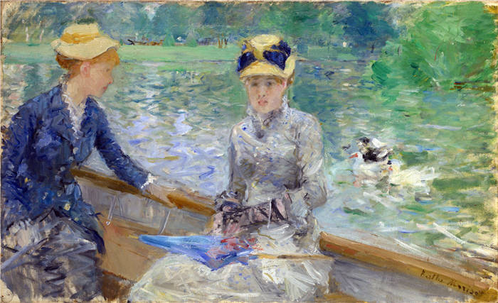

## 基本信息

- 作者：[[莫利索 Berthe Morisot]]
- 创作年代：1879
- 材质：布面油画 (*not from wiki*)
- 尺寸：45.7 × 75.2 cm (*not from wiki*)
- 现存地：英国伦敦国家美术馆 (*not from wiki*)

## 画面与技法

布洛涅森林湖面，小船上两位身着浅色夏装的女子。**笔触极度松散、模糊**——042 顾衡：

> "我们看印象派作品，**总有一种不清晰的感觉，就像焦距没对准似的**，原因就在于此。**莫利索的这幅《夏日》也有这个特点**。"

技法特征：

- **断裂的、逗号或小圆弧的分离笔触**
- **白色打底带来的整体高亮度**
- **湖面反光与人物衣物的统一光照**

## 历史背景 (*not from wiki*)

1880 年第五届印象派画展上展出。是 [[莫利索 Berthe Morisot]] 1870s 后期最具代表性的作品之一。

## 图片清单

| 编号 | 出自 | 描述 |
|---|---|---|
| 01 | [[042｜莫奈2：《日出·印象》是不是印象派作品？]] | 全画：布洛涅森林湖上小船与两位夏装女子 |

## 出现在

- [[042｜莫奈2：《日出·印象》是不是印象派作品？]]
