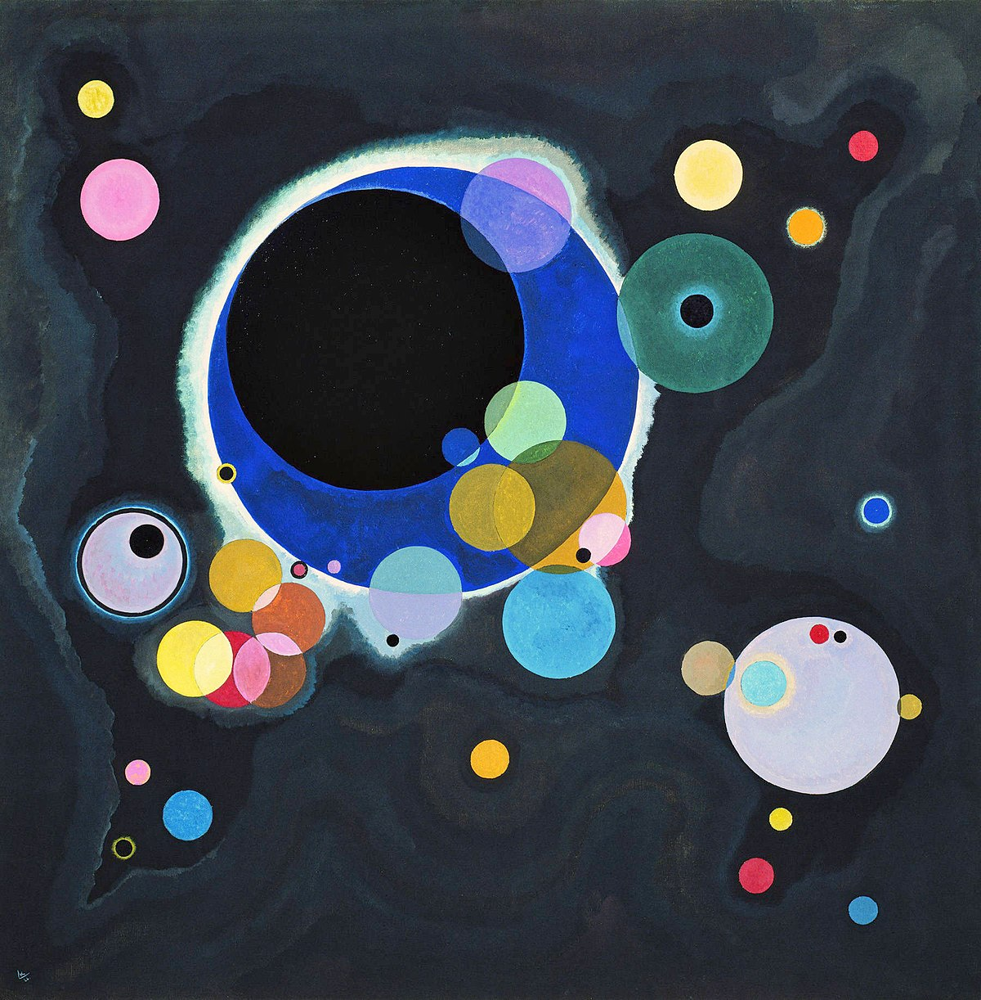
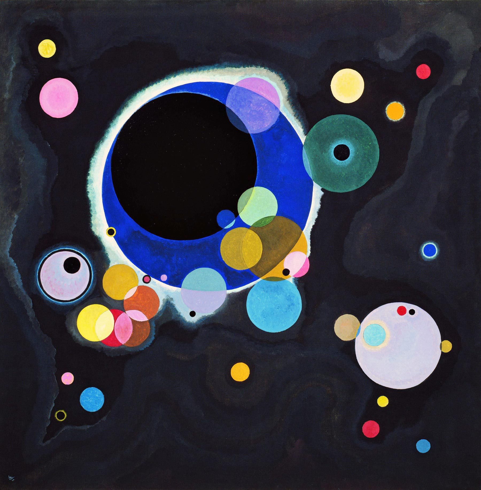

## 基本信息

- 作者：[[康定斯基 Wassily Kandinsky]]
- 创作年代：1926
- 材质：布面油画 (*not from wiki*)
- 尺寸：(*not from wiki*：140 × 140 cm)
- 现存地：(*not from wiki*：纽约古根海姆博物馆 Solomon R. Guggenheim Museum)

## 画面与技法

深色背景上漂浮多个半透明的彩色圆。线条、色块**都不指向也不暗示客观世界中存在的事物**——是经典的 [[抽象绘画 Abstract Painting]]。

与同时期 [[第一步 (库普卡) The First Step]] 在画面上同样"画了一些圆圈圈"，但本作没有任何具象指代意图，因此**是**抽象画；库普卡那幅则不是。

## 历史背景 (*not from wiki*)

康定斯基包豪斯时期 (1922–1933) 的代表作之一，体现其从早年带俄罗斯圣像画元素的野兽派（如 [[蓝山 Blue Mountain]]）出发，最终切断线条与色彩与外界一切联系的成熟抽象风格。

## 图片清单

| 编号 | 出自 | 描述 |
|---|---|---|
| 01 | [[081｜康定斯基1：什么是抽象绘画？]] | 深色背景，多个半透明彩圆 |

## 出现在

- [[081｜康定斯基1：什么是抽象绘画？]]
