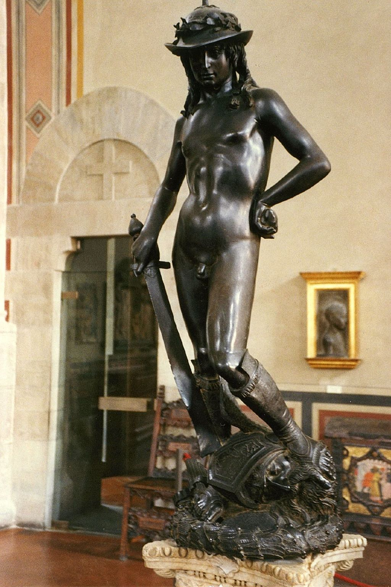

## 基本信息

- 作者：[[多纳泰罗 Donatello]]
- 创作年代：1440 年代
- 材质：青铜 (*not from wiki*)
- 尺寸：高约 158 cm (*not from wiki*)
- 现存地：佛罗伦萨巴杰罗国立博物馆 Bargello Museum (*not from wiki*)

## 画面与技法

文艺复兴早期标志雕塑——**首件文艺复兴独立青铜裸体雕塑**（*not from wiki*）。在 060 中作为**对照样本**出场——1905 [[秋季沙龙展 Salon d'Automne]] 第七展室中间有"一尊丘比特小雕像，倒是中规中矩，表现出文艺复兴早期著名雕塑家多纳泰罗的风格"，[[瓦克塞尔 Louis Vauxcelles]] 看到此雕像后惊呼"**多纳泰罗被一群野兽包围了！**"——[[野兽派 Fauvism]] 由此得名。

> 060 严格意义上只是说"多纳泰罗的风格"（指秋季沙龙现场那尊丘比特小雕像与多纳泰罗类似），并非展出多纳泰罗本作的《大卫》。但顾衡用本作来给出风格示意：**"感受一下多纳泰罗的风格"**——文艺复兴早期那种**人体精确写实、姿态古典平衡**的雕塑标尺。

## 历史背景 (*not from wiki*)

由 [[美第奇家族 Medici Family]] 委托制作，原置于美第奇宫庭院。本作复活了古典裸体雕塑传统——古希腊罗马以后近千年第一件西方裸体独立雕像。少年大卫脚踏歌利亚被砍下的头颅、戴着月桂帽、手持剑——融合古典理想与文艺复兴早期写实。

## 图片清单

| 编号 | 出自 | 描述 |
|---|---|---|
| 01 | [[060｜马蒂斯1：野兽派从何而来？]] | 全像——"感受一下多纳泰罗的风格" |

## 出现在

- [[060｜马蒂斯1：野兽派从何而来？]]
