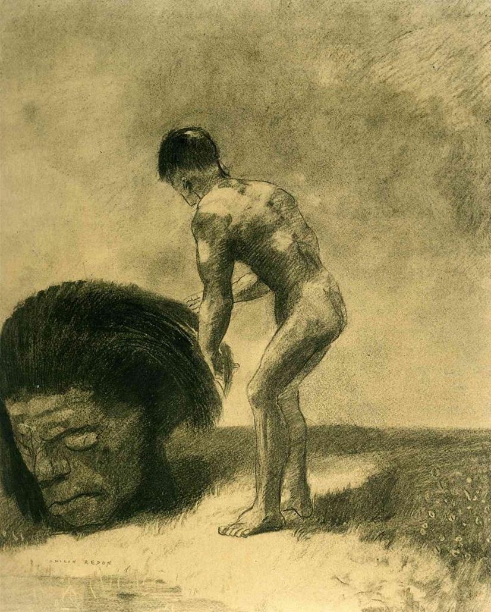

## 基本信息

- 作者：[[雷东 Odilon Redon]]
- 创作年代：1875
- 材质：年代不详（雷东早期"黑色时期"常用炭笔 / 石版画 / 黑色蛋彩）
- 尺寸：年代不详
- 现存地：未注明

## 画面与技法

雷东早期黑白阶段对圣经母题（大卫 vs 歌利亚）的处理，被顾衡 051 用作雷东 **"黑色是最为本质的色彩"** 阶段的代表案例之一。

## 历史背景 (*not from wiki*)

母题取自《撒母耳记上》17 章：少年大卫以投石器击杀巨人歌利亚。雷东以阴影、模糊轮廓而非清晰线条来处理，刻意背离学院派（[[热罗姆 Jean-Léon Gérôme]]）"明确线条"的教学要求。

## 图片清单

| 编号 | 出自 | 描述 |
|---|---|---|
| 01 | [[051｜雷东：怪诞是不是象征主义的方向？]] | 雷东 1875 |

## 出现在

- [[051｜雷东：怪诞是不是象征主义的方向？]]
