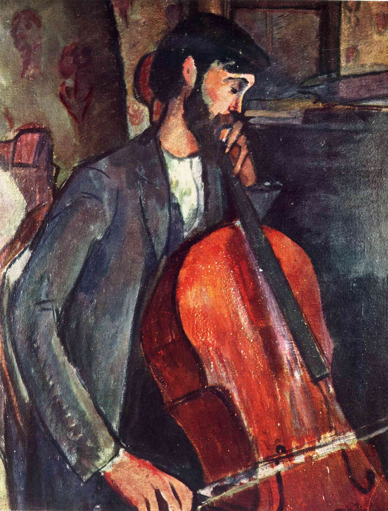

## 基本信息

- 作者：[[莫迪里阿尼 Amedeo Modigliani]]
- 创作年代：1909
- 材质：布面油画 (*not from wiki*)
- 尺寸：约 130 × 81 cm (*not from wiki*)
- 现存地：私人收藏 (*not from wiki*)

## 画面与技法

顾衡 078 用此作与 [[呐喊 The Scream]] 直接对照，指出二者处理情感的方式根本不同：

- 蒙克《呐喊》——**把画面中人物的表现符号化和程式化**（[[蒙克程式 Munch's Pictorial Formulas]]）
- 莫迪里阿尼《大提琴演奏家》——**如同音乐一样，把情感弥散或沉浸在整个画面中**

这种"音乐式弥散"在他后来的成熟肖像中将进一步发展。本作仍处于受蒙克影响的过渡期（晦暗色调），但情绪表达的策略已开始与蒙克分道扬镳。

## 历史背景 (*not from wiki*)

1909 年完成；同年莫迪里阿尼在两次沙龙展上与 [[布朗库西 Constantin Brâncuși]] 的雕塑同室展出，发展出友谊——这次相遇此后将彻底改变他的创作走向（顾衡 078）。

## 图片清单

| 编号 | 出自 | 描述 |
|---|---|---|
| 01 | [[078｜莫迪里阿尼：画中女子为什么让人一眼难忘？]] | 大提琴手立像 |

## 出现在

- [[078｜莫迪里阿尼：画中女子为什么让人一眼难忘？]]
