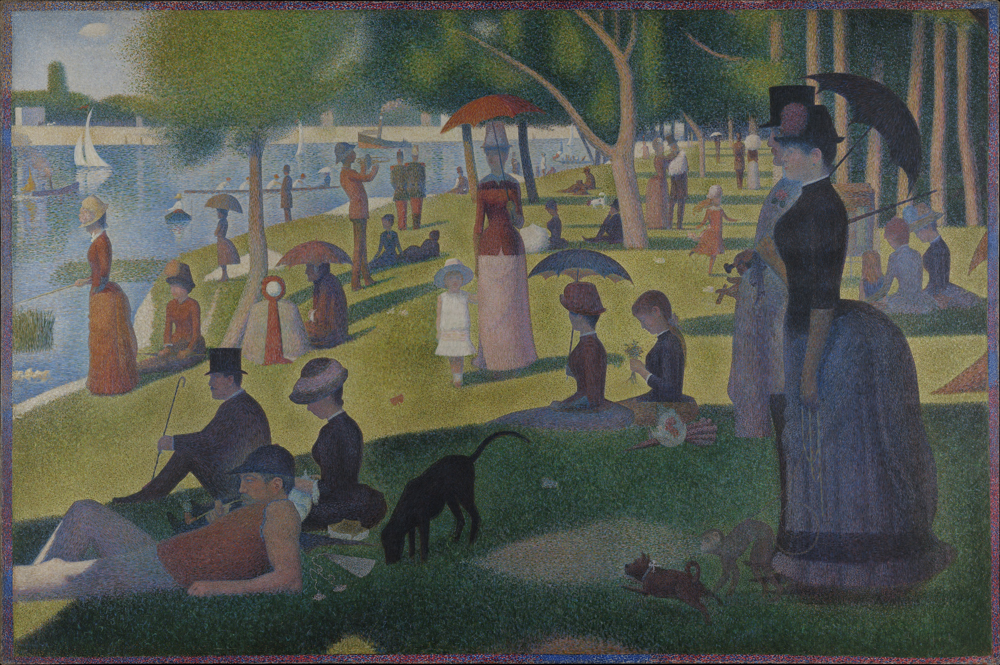

## 基本信息

- **作者**：[[修拉 Georges Seurat]]
- **创作年代**：1884–1886
- **材质**：(*not from wiki*) 布面油画
- **尺寸**：(*not from wiki*) 207.6 × 308 cm
- **现存地**：(*not from wiki*) 芝加哥艺术博物馆 (Art Institute of Chicago)

## 画面与技法

**[[新印象主义 Neo-Impressionism]] / [[分色主义 Divisionism]] / [[点彩 Pointillism]] 的奠基代表作**。修拉用**大小相等、间距相等的小圆点**（即点彩）+ **22 色 + 强度值 0–1 的 360 度色轮**预先计算颜色配比，再让观众视网膜在 [[视觉混和 Optical Mixing]] 中合成最终色彩。

顾衡 047 的精确数据：
- **修拉光是点小点点，就点了一年多**（不算前面的素描构图准备工作）
- 修拉作画时**画架旁真有黑板**列式子算

顾衡反讽的现代视角：

> "这种画画的办法，咱们今天一看就知道，这不就是像素吗？ＲＧＢ啊ＣＭＹＫ的，这个咱们熟。但是咱们现在手机一平方英寸能达到几千万像素，修拉手工点小点儿，哪有这个精度啊？"

## 历史背景 *(not from wiki)*

- 1886 年在第八届（也是最后一届）印象派画展首次展出 —— **新印象主义运动正式登场**的标志
- [[费奈昂 Félix Fénéon]] 当年评论时为画法起名"**新印象主义**" —— 但修拉本人不同意，自命 [[分色主义 Divisionism]]
- 1901 年修拉去世 10 年后，其妻贱卖此画**仅 800 法郎**（顾衡 047 明示）
- 1924 年由 Bartlett 家族买入芝加哥艺术博物馆，至今为该馆镇馆之宝

## 市场冷遇（顾衡 047）

- 修拉**32 岁死于白喉**（1891）
- 妻子 1901 年卖此画 **800 法郎** / 卖《[[马戏 The Circus]]》**500 法郎**

## 同行评价（顾衡 047）

- 跟风者：[[毕沙罗 Camille Pissarro]] 跟着点点点画了好几年（《[[收干草 (毕沙罗) The Hay Harvest]]》）；[[凡·高 Vincent van Gogh]] "被忽悠"
- 批评者：[[莫奈 Claude Monet]]"**苍蝇拉屎**"、[[高更 Paul Gauguin]]"**小药剂师**"
- 评论家："**小剂量的科学不会危及艺术。但是如果科学太多，艺术就没有了。**"
- [[左拉 Émile Zola]] 看后宣告："**印象派不复存在了。**"

## 图片清单

| 编号 | 出自 | 描述 |
|---|---|---|
| 01 | [[047｜修拉：新印象主义为什么走进了死胡同？]] | 整幅画作 |

## 出现在

- [[047｜修拉：新印象主义为什么走进了死胡同？]]
