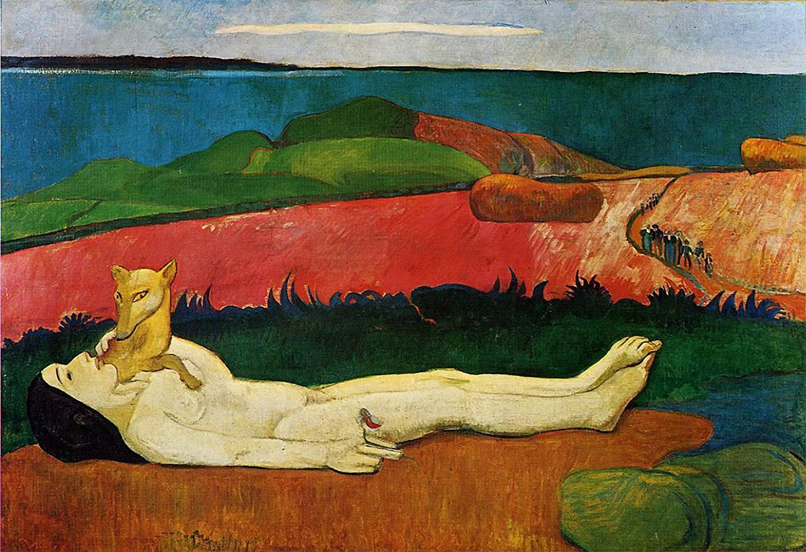

## 基本信息

- 作者: [[高更 Paul Gauguin]]
- 创作年代: 1890–1891
- 材质: 布面油画 (*not from wiki*)
- 尺寸: 90 × 130 cm (*not from wiki*)
- 现存地: 克莱斯勒博物馆，弗吉尼亚州诺福克市 (Chrysler Museum of Art, Norfolk) (*not from wiki*)

## 画面与技法

- 模特：朱丽叶·于埃 (Juliette Huet)，不到 20 岁的裁缝——高更画这幅画时刚把她追到手。
- 构图：新情人手拿一朵野花躺在深冬郊外；一只罪恶的狐狸把"淫邪的爪子"搭在姑娘胸口。
- 中景的草地、岩石、山坡和远景的海洋"都被简化处理为鲜艳的色块"。
- 一条丝线一样的小路上"迤逦走来一队迎亲的队伍"。
- 技法：典型 [[综合主义 Synthetism]]——形体简化、[[景泰蓝派 Cloisonnism|景泰蓝式平涂]]；用不同的绿和不同的蓝构造 [[主观色彩序列 Subjective Colour Sequence]] 营造纵深，不靠阴影。

## 历史背景 (*not from wiki*)

高更阿旺桥时期 / 离巴黎赴塔希提之前的关键过渡作。常被视为 [[综合主义 Synthetism]] 的纲领性代表作——顾衡："**这幅画可以被看作是高更的综合主义的代表作，因为它以非常直白的方式表达了综合主义的创作理念。用高更自己的话说就是：'在完成对形的简化的同时，增加思想的复杂性'。**"

## 图片清单

| 编号 | 出自 | 描述 |
|---|---|---|
| 01 | [[056｜高更2：象征主义还能走多远？]] | 全图 — 模特裸卧深冬郊外，狐狸搭爪 |

## 出现在

- [[056｜高更2：象征主义还能走多远？]]
