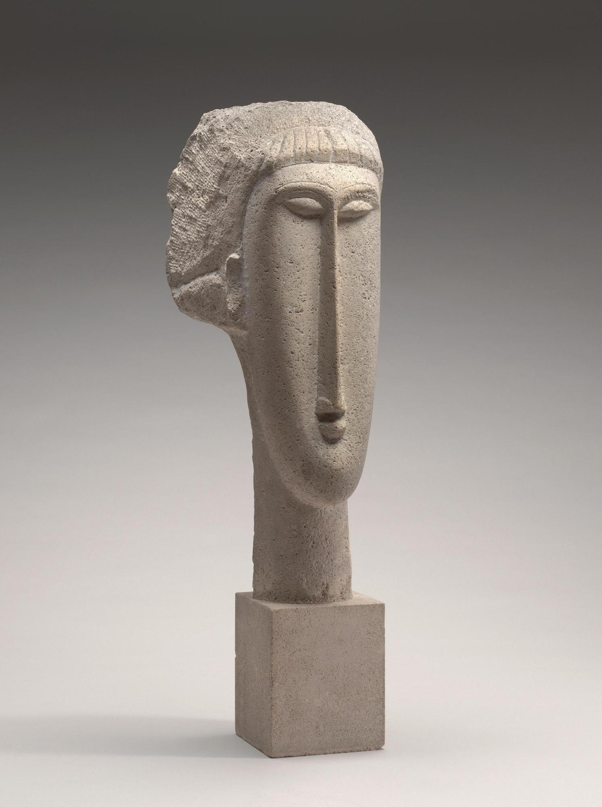

## 基本信息

- 作者：[[莫迪里阿尼 Amedeo Modigliani]]
- 创作年代：1910–1911
- 材质：石灰石 (*not from wiki*)
- 尺寸：约 65 cm 高 (*not from wiki*)
- 现存地：(*未知；多件存于巴黎蓬皮杜、纽约 MoMA、伦敦泰特等*) (*not from wiki*)

## 画面与技法

[[莫迪里阿尼 Amedeo Modigliani]] 1909 起转攻雕塑后的代表作。受 [[布朗库西 Constantin Brâncuși]] 影响——拉长的脸、几乎成柱状的颈、**不可思议地长的鼻子**。

顾衡 078 关键澄清：**这并不是对当时风靡一时的非洲雕像的模仿**，而是 [[马丁尼 Simone Martini]] 的程式化与追求 [[理念美 Idea of Beauty]] 的奇妙组合：

> 这个过长的鼻子，我们要把它理解为与布朗库西的 [[空间的鸟 (布朗库西) Bird in Space]] 同样的，**对纯粹形式美的追求**。

## 历史背景 (*not from wiki*)

莫迪里阿尼仅做了五年雕塑（1909–1914）即因结核与经济原因放弃；这一段经历形成的"原型 + 拉长 + 简化"原则**完整带回到他后来的肖像画**，成为其标志风格的源头。

## 图片清单

| 编号 | 出自 | 描述 |
|---|---|---|
| 01 | [[078｜莫迪里阿尼：画中女子为什么让人一眼难忘？]] | 长鼻女头石灰石雕 |

## 出现在

- [[078｜莫迪里阿尼：画中女子为什么让人一眼难忘？]]
