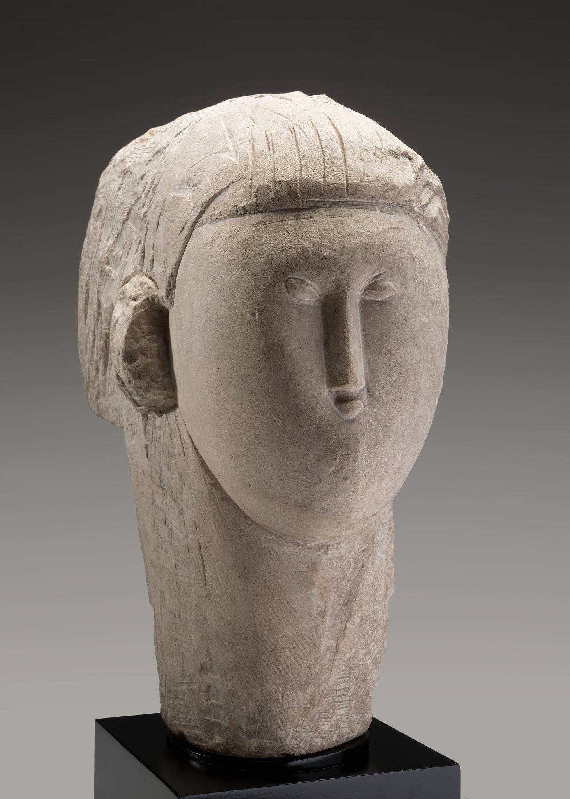

## 基本信息

- 作者：[[莫迪里阿尼 Amedeo Modigliani]]
- 创作年代：1913
- 材质：石灰石 (*not from wiki*)
- 尺寸：(*未知*)
- 现存地：(*未知*)

## 画面与技法

[[莫迪里阿尼 Amedeo Modigliani]] 雕塑期更进一步的作品。比 [[头像 (莫迪里阿尼 1910) Head of a Woman]] 更瘦长、更几何化——脸进一步压扁为一片纵向板块，鼻子拉得更长，五官越发简略。

顾衡 078 把这两件石灰石头像作为 **马丁尼程式化 × 布朗库西原型追求** 在雕塑层面的结合：长鼻 = 对"鼻"的纯粹形式美的追求，而非对非洲雕塑的简单挪用。

## 历史背景 (*not from wiki*)

1913 年莫迪里阿尼在巴黎沙龙展出系列石头像；这一年是他雕塑创作的高峰期，次年因身体与经济原因即放弃雕塑回归绘画。

## 图片清单

| 编号 | 出自 | 描述 |
|---|---|---|
| 01 | [[078｜莫迪里阿尼：画中女子为什么让人一眼难忘？]] | 更加瘦长几何化的头像 |

## 出现在

- [[078｜莫迪里阿尼：画中女子为什么让人一眼难忘？]]
