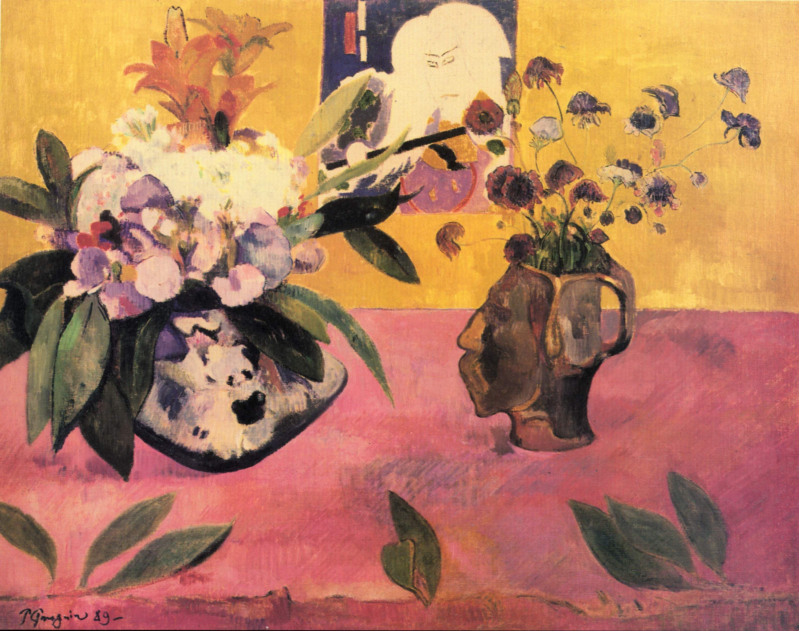

## 基本信息

- 作者: [[高更 Paul Gauguin]]
- 创作年代: 1889
- 材质: 布面油画 (*not from wiki*)
- 尺寸: 年代不详
- 现存地: (*not from wiki*) 私人收藏（待核）

## 画面与技法

静物画——画面中陈列高更自制的人像头形陶瓷花瓶 + [[木刻版画 Woodcut|日本浮世绘]]。顾衡 055 将此画作为"高更在阿旺桥时期已显露出对日本浮世绘的吸收"的视觉证据，恰好为[[贝尔纳 Émile Bernard]]随后向他介绍"景泰蓝派绘画"提供了切入口。

## 历史背景 (*not from wiki*)

1889 高更与[[贝尔纳 Émile Bernard]]在阿旺桥共同生活、互相影响——[[日本浮世绘 Ukiyo-e]]（待建条目）的扁平色块与封闭轮廓线，是促成两人都走向[[景泰蓝派 Cloisonnism]]的关键外部刺激。

## 图片清单

| 编号 | 出自 lecture | 描述 |
|---|---|---|
| 01 | [[055｜高更1：为什么从印象派走向象征主义？]] | 全图 |

## 出现在

- [[055｜高更1：为什么从印象派走向象征主义？]]
