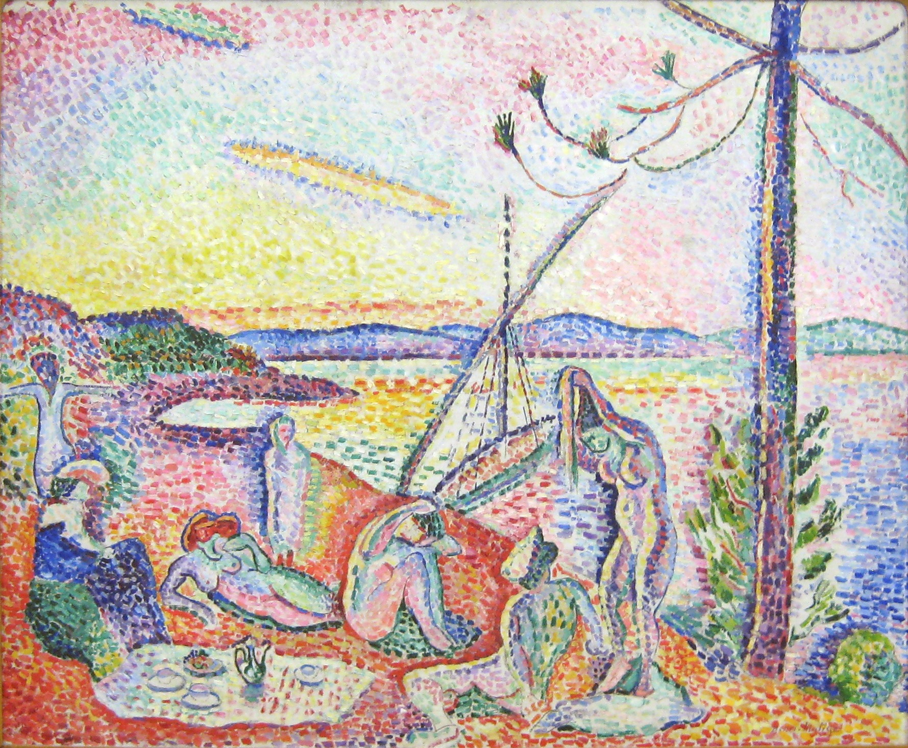

## 基本信息

- 作者：[[马蒂斯 Henri Matisse]]
- 创作年代：1904
- 材质：油彩，画布 (*not from wiki*)
- 尺寸：98.5 × 118.5 cm (*not from wiki*)
- 现存地：奥赛博物馆，巴黎 (*not from wiki*)

## 画面与技法

[[马蒂斯 Henri Matisse]] **与新印象主义彻底分道扬镳的标志**（060 明示）—— 顾衡："**这幅《奢华、宁静和欢乐》，恰恰是马蒂斯与新印象主义彻底分道扬镳的标志，他很快就找到了真正属于自己的道路。**"

按 [[新印象主义 Neo-Impressionism]] 的 [[点彩 Pointillism|点彩]] 技法画，但**做了关键背离**：

- **新印象主义**：经过精密计算，**用不同颜色的纯色小点子混合成一个新的颜色**
- **马蒂斯的版本**：**把相同颜色的纯色小点子连成一片**，让**天空中的红与绿、湖水中的黄与紫，彼此泾渭分明**

仍是**混搭风格**：
- **前景野餐布** —— 有 [[马奈 Édouard Manet]]《[[草地上的午餐 The Luncheon on the Grass]]》的影子
- **线描的裸女形象** —— 显然取材自 [[塞尚 Paul Cézanne]]《[[浴女们 (塞尚 1874) The Bathers (Cézanne 1874)|浴女们]]》
- **背景的小点子** —— 但与新印象主义理念**大异其趣**（同色连成片，不混色）

## 历史背景 (*not from wiki*)

### 标题与主题

主题取自 [[波德莱尔 Charles Baudelaire]] 1857《恶之花》中《西苔岛之旅》(L'Invitation au voyage / Voyage à Cythère 系列) 的诗句：

> 在那里 / 一切如此美丽而秩序井然 / 奢华、宁静，充满欢乐
>
> Là, tout n'est qu'ordre et beauté / Luxe, calme et volupté

### 西涅克买下与预言

本作完成后被 [[西涅克 Paul Signac]] **买下**——他不无伤感地对马蒂斯说："**亨利，你不会长久和我们在一起的。**" 西涅克的这个预言果然成真——一年后 1905 年秋，马蒂斯就以《[[戴帽子的女人 Woman with a Hat]]》引爆 [[野兽派 Fauvism]]。

## 图片清单

| 编号 | 出自 | 描述 |
|---|---|---|
| 01 | [[060｜马蒂斯1：野兽派从何而来？]] | 全图——与新印象主义分道扬镳的标志 |

## 出现在

- [[060｜马蒂斯1：野兽派从何而来？]]
