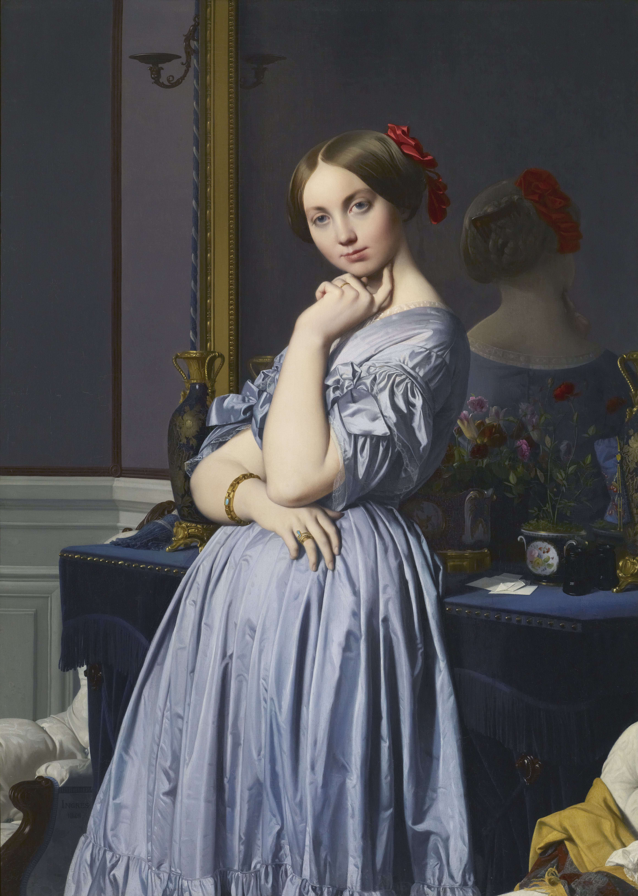

## 基本信息

- 作者：[[安格尔 Jean-Auguste-Dominique Ingres]]
- 创作年代：1845
- 材质：布面油画 (*not from wiki*)
- 尺寸：131.8 × 92.0 cm (*not from wiki*)
- 现存地：(*not from wiki*) 纽约弗里克收藏 (The Frick Collection)

## 画面与技法

露易丝·伯爵夫人 (Louise, Princesse de Broglie) 倚柜微侧站立、左手托腮、右手轻搭腰带。**构图的非常规之处**——

- 衣服颜色素雅，整体浅蓝灰
- **脸部偏高于画面几何中心**——按常规会让构图失衡

**安格尔的解题**：在人物身后**安排一面镜子**——

- 镜面反射出人物**光洁的后颈与鲜艳的红发卡**
- 让画面**上部增加亮色**，把观者注意力**向上提**
- 既稳定了构图，又**让观者与人物形成对视**

顾衡 032 的关键论断——**驳"安格尔素描强但色彩弱"通说**：

> "今天总有人说安格尔素描强但是色彩弱，但是你看这幅画头发的色泽、衣物与肌肤的质地。**精准的线条让整个画面干净利索，但同时，安格尔在色彩上的高超能力，又让人物显得逼真和生动。**"

并以本作与 [[年轻女子肖像 (波蒂切利) Portrait of a Young Woman]] 对比，**论证安格尔技术上的全面性"强得不止一星半点"**。

## 历史背景

(*not from wiki*) 模特奥松维尔伯爵夫人是 19 世纪法国贵族、内克尔家族成员、外交家奥松维尔伯爵之妻、作家。安格尔为其作画历时 3 年，是其晚年女性肖像画的代表作。

## 图片清单

| 编号 | 出自 | 描述 |
|---|---|---|
| 01 | [[032｜安格尔：为什么他是学院派最后一位大师？]] | 整体画面 |

## 出现在

- [[032｜安格尔：为什么他是学院派最后一位大师？]]
