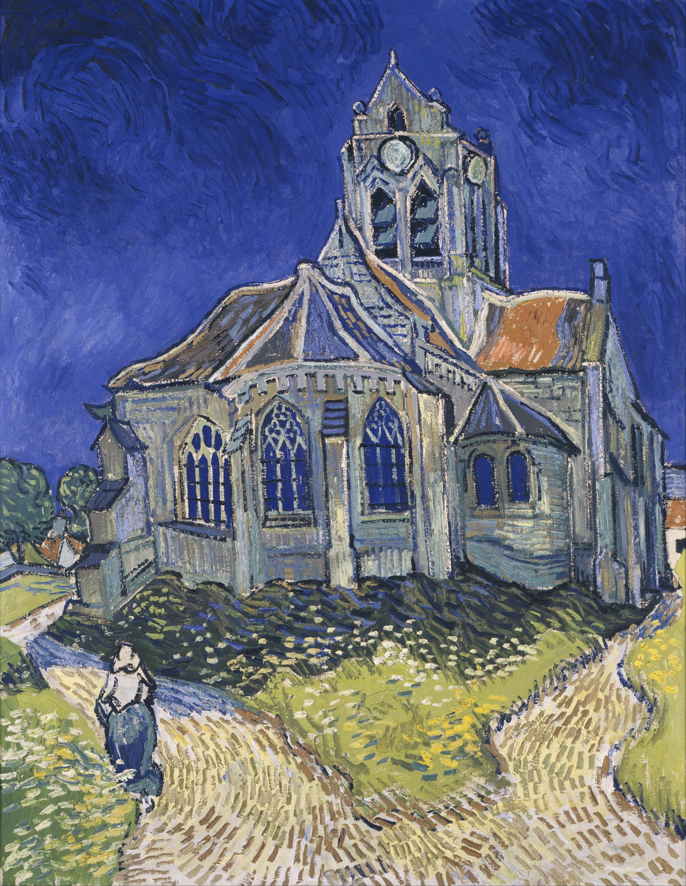

## 基本信息

- 作者：[[凡·高 Vincent van Gogh]]
- 创作年代：1890
- 材质：布面油画 (*not from wiki*)
- 尺寸：94 × 74 cm (*not from wiki*)
- 现存地：巴黎奥赛博物馆 (*not from wiki*)

## 画面与技法

凡·高生命最后两个月——1890 年 5–7 月在奥维尔小镇创作。哥特式教堂被以扭动倾斜的笔触绘出，深紫的夜空与黄绿色的草地形成尖锐对比。顾衡 059 把它与 [[丝柏 Road with Cypress and Star]]、[[星月夜 The Starry Night]] 并列为"病后笔触更加狂放、情绪却是悲凉绝望"的代表作。

## 历史背景 (*not from wiki*)

奥维尔（Auvers-sur-Oise）是凡·高临终前由弟弟提奥安排、由 Gachet 医生看护的最后居所。凡·高死后葬于此地教堂墓园。

## 图片清单

| 编号 | 出自 | 描述 |
|---|---|---|
| 01 | [[059｜凡·高3：他为什么走向毁灭？]] | 蓝紫夜空下扭动的哥特教堂 |

## 出现在

- [[059｜凡·高3：他为什么走向毁灭？]]
