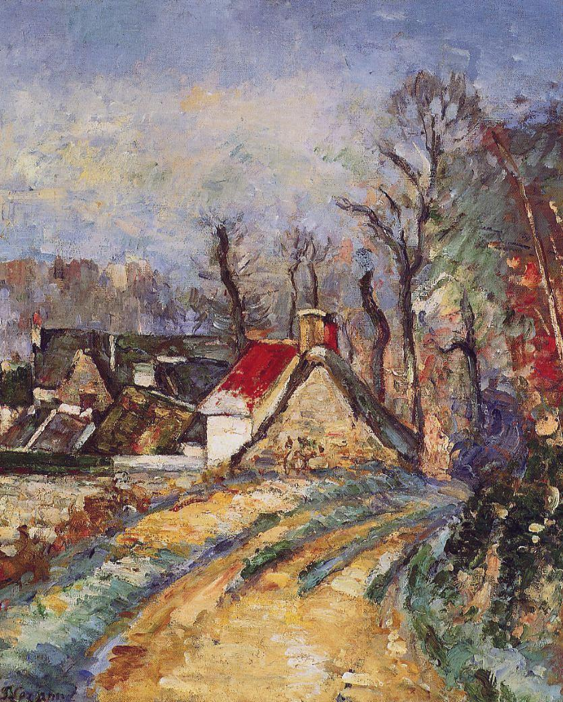

## 基本信息

- 作者：[[塞尚 Paul Cézanne]]
- 创作年代：1873
- 材质：油彩，画布 (*not from wiki*)
- 尺寸：(*not from wiki*) 约 47 × 55 cm
- 现存地：(*not from wiki*) 美国波士顿美术馆 / 流转中

## 画面与技法

[[塞尚 Paul Cézanne]] 在蓬图瓦兹时期与 [[毕沙罗 Camille Pissarro]] **共同写生**的作品之一——顾衡 053 明示"两位好朋友甚至就同一片风景，在一起画了十几幅作品，比如《奥维尔的环路》"。本作显示塞尚从马奈式厚涂阔笔**转入毕沙罗式小笔触构建体块**的过渡——画风趋于平静，开始用**深思熟虑的小笔触**塑造房屋、树木与道路的体量关系。

## 历史背景 (*not from wiki*)

1872-1874 塞尚在 Auvers-sur-Oise 与毕沙罗常驻——这段时期被艺术史家公认为塞尚的"印象派学徒期"。本作风格上接近毕沙罗，但已显露出塞尚特有的几何化倾向。

## 图片清单

| 编号 | 出自 | 描述 |
|---|---|---|
| 01 | [[053｜塞尚2：如何打造艺术的平行世界？]] | 全图 |

## 出现在

- [[053｜塞尚2：如何打造艺术的平行世界？]] —— 塞尚与毕沙罗在蓬图瓦兹共同写生的代表作之一
