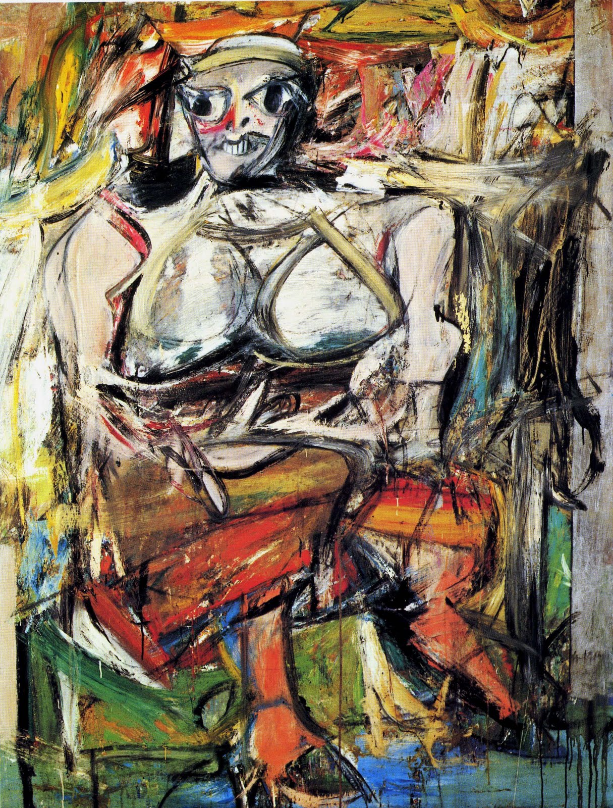

## 基本信息

- 作者：[[德·库宁 Willem de Kooning]]
- 创作年代：1950–1952
- 材质：布面油画 (*not from wiki*)
- 尺寸：约 192.7 × 147.3 cm (*not from wiki*)
- 现存地：纽约现代艺术博物馆 (MoMA) (*not from wiki*)

## 画面与技法

德·库宁回归 **具象绘画** 的标志性《女人》系列开篇之作。从抽象表现主义"行动绘画"的笔触语言出发——保留画笔与画架、用画笔在画布上狂涂——但收束到一个**狰狞的女性形象**。本讲（097）作为德·库宁后期"放弃抽象表现主义、回归具象绘画"的具体例证出现，让"刚把他捧成抽象表现主义一哥的评论家们脸上感到一阵阵火辣辣的疼"。

## 图片清单

| 编号 | 出自 | 描述 |
|---|---|---|
| 01 | [[097｜德·库宁：抽象表现主义追求什么？]] | 狰狞的女性形象，巨齿、夸张的眼睛与胸部，狂乱的笔触 |

## 出现在

- [[097｜德·库宁：抽象表现主义追求什么？]] — 与女人三同列、回归具象的标志
