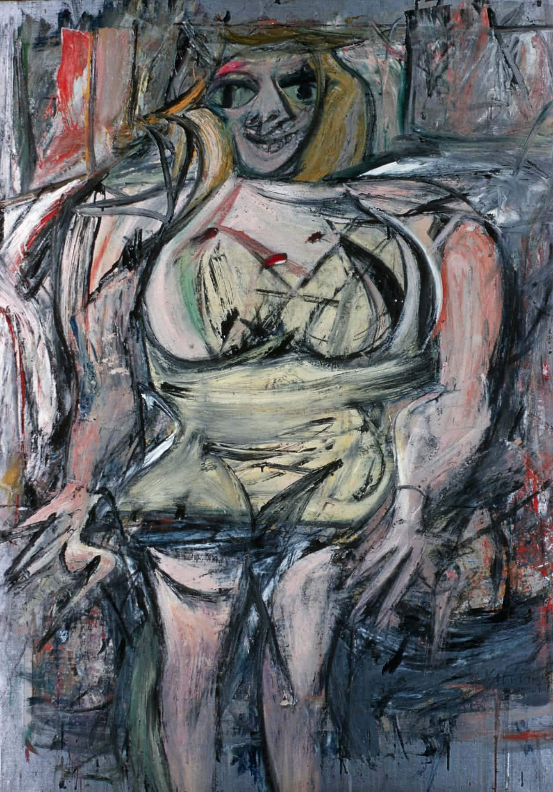

## 基本信息

- 作者：[[德·库宁 Willem de Kooning]]
- 创作年代：1953
- 材质：布面油画 (*not from wiki*)
- 尺寸：约 172.7 × 123.2 cm (*not from wiki*)
- 现存地：私人收藏（曾为德黑兰当代艺术博物馆，2006 后由 David Geffen 等持有）(*not from wiki*)

## 画面与技法

德·库宁《女人》系列之一。延续 [[女人一 (德·库宁) Woman I]] 的语言：**学院派功底 + 行动绘画笔触**——用画笔狂涂的同时锁定一个**狰狞的女性形象**。本讲（097）在论述德·库宁"足够抽象、足够无序、每个笔触都要表达情感的张力"两条标准之后，作为代表作出现。

## 图片清单

| 编号 | 出自 | 描述 |
|---|---|---|
| 01 | [[097｜德·库宁：抽象表现主义追求什么？]] | 狰狞女性正面像，狂乱笔触、面部表情极具张力 |

## 出现在

- [[097｜德·库宁：抽象表现主义追求什么？]] — 抽象表现主义阶段后期 / 具象回归过渡期代表
