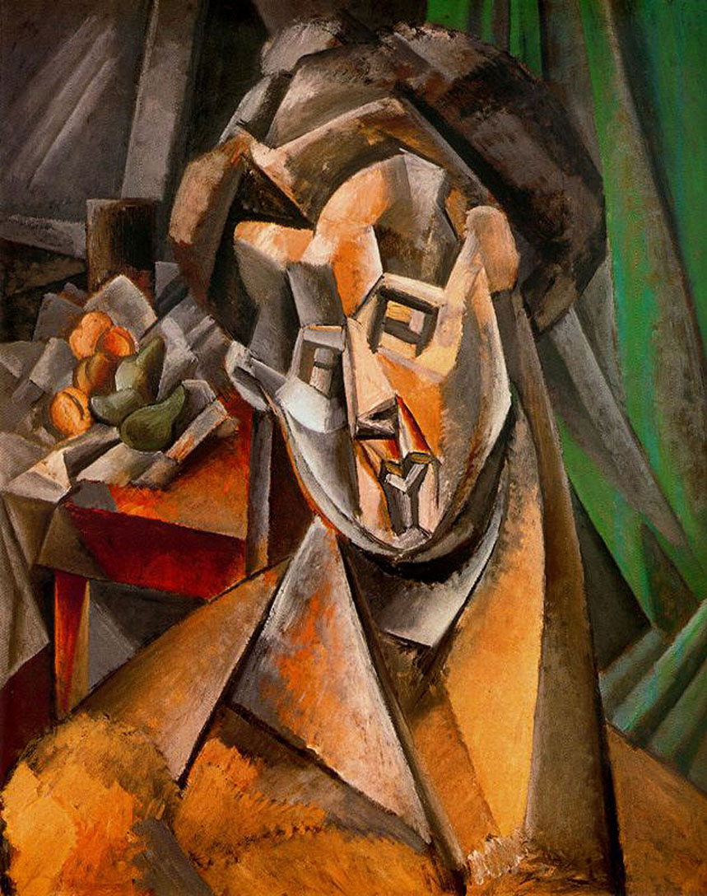

## 基本信息

- 作者：[[毕加索 Pablo Picasso]]
- 创作年代：1909
- 材质：布面油画 (*not from wiki*)
- 尺寸：92 × 73 cm (*not from wiki*)
- 现存地：纽约现代艺术博物馆 MoMA (*not from wiki*)
- 画中人：[[费尔南德 Fernande Olivier]]

## 画面与技法

[[分析立体主义 Analytical Cubism]] 早期肖像——

- 画中人是毕加索 1904–1912 的伴侣 [[费尔南德 Fernande Olivier]]。
- 与同时期画情人 [[伊娃 Eva Gouel]] 的《[[伊娃在扶手椅中 Eva in an Armchair]]》**形貌几乎一致**——只能通过画中**梨**这一具象符号分辨主人公是谁。
- 顾衡（066）用这对"双胞胎肖像"举证 [[分析立体主义 Analytical Cubism]] 的根本矛盾：**画出"本质"就要砸碎"表象"，结果是外观个性化的丧失**。
- 毕加索得意宣称："拉斐尔的绘画，测量不出人物的鼻子与嘴巴之间的精确距离，我能！"

## 历史背景 (*not from wiki*)

- 1909 年夏天毕加索在西班牙 Horta de Sant Joan（Horta de Ebro）度假期间创作；同段时间他正与 [[勃拉克 Georges Braque]] 通信，分析立体主义的雏形在两人间形成。
- 1912 年费尔南德跟一个未来主义画家私奔后，毕加索与她八年的恋情走到尽头；本作成为她"在毕加索画布上"的告别像。

## 图片清单

| 编号 | 出自 | 描述 |
|---|---|---|
| 01 | [[066｜毕加索3：什么是分析立体主义？]] | 全图——[[费尔南德 Fernande Olivier]] 肖像；梨为辨识符号 |

## 出现在

- [[066｜毕加索3：什么是分析立体主义？]] —— [[分析立体主义 Analytical Cubism]] 中"外观个性化丧失"的双胞胎案例之一
