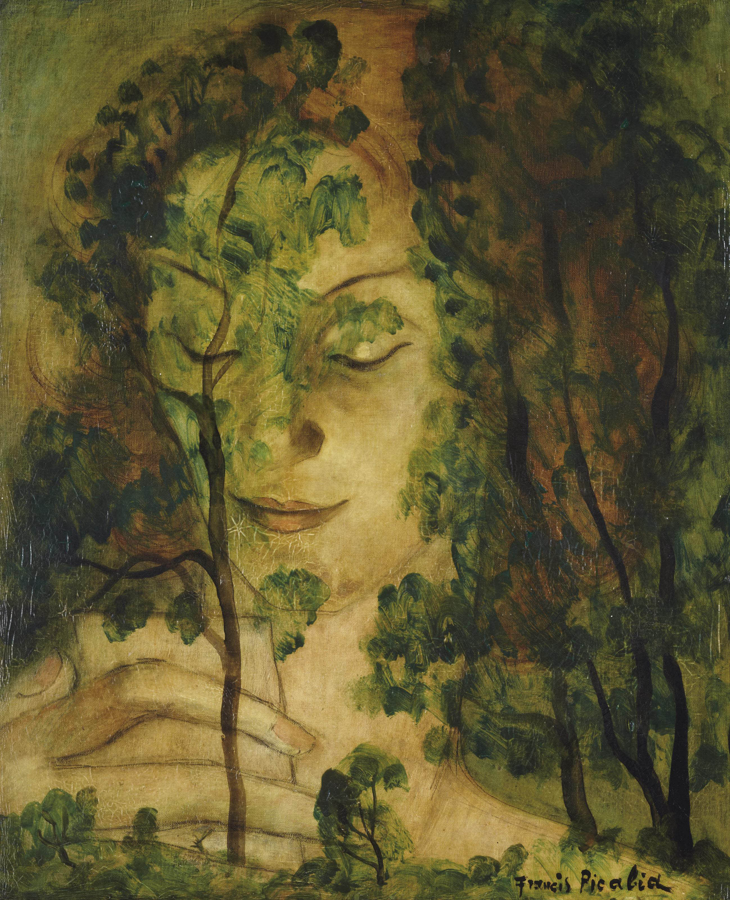

## 基本信息

- 作者：[[毕卡比亚 Francis Picabia]]
- 创作年代：1930
- 材质：布面油画 (*not from wiki*)
- 尺寸：年代不详 (*not from wiki*)
- 现存地：私人收藏 (*not from wiki*)

## 画面与技法

[[毕卡比亚 Francis Picabia]] **[[毕卡比亚画派 Picabia School]] 透明画期**作品——人物与树的轮廓互相穿透，多层图像叠加。

## 历史背景

(*not from wiki*) 1930 年透明画系列接近尾声；毕卡比亚的对抗性画派"终究是大势已去……很快就靠边站了"。

## 图片清单

| 编号 | 出自 | 描述 |
|---|---|---|
| 01 | [[091｜毕卡比亚：如何用绘画表现达达主义？]] | 整体图 — 女人与树的透明叠画 |

## 出现在

- [[091｜毕卡比亚：如何用绘画表现达达主义？]]
