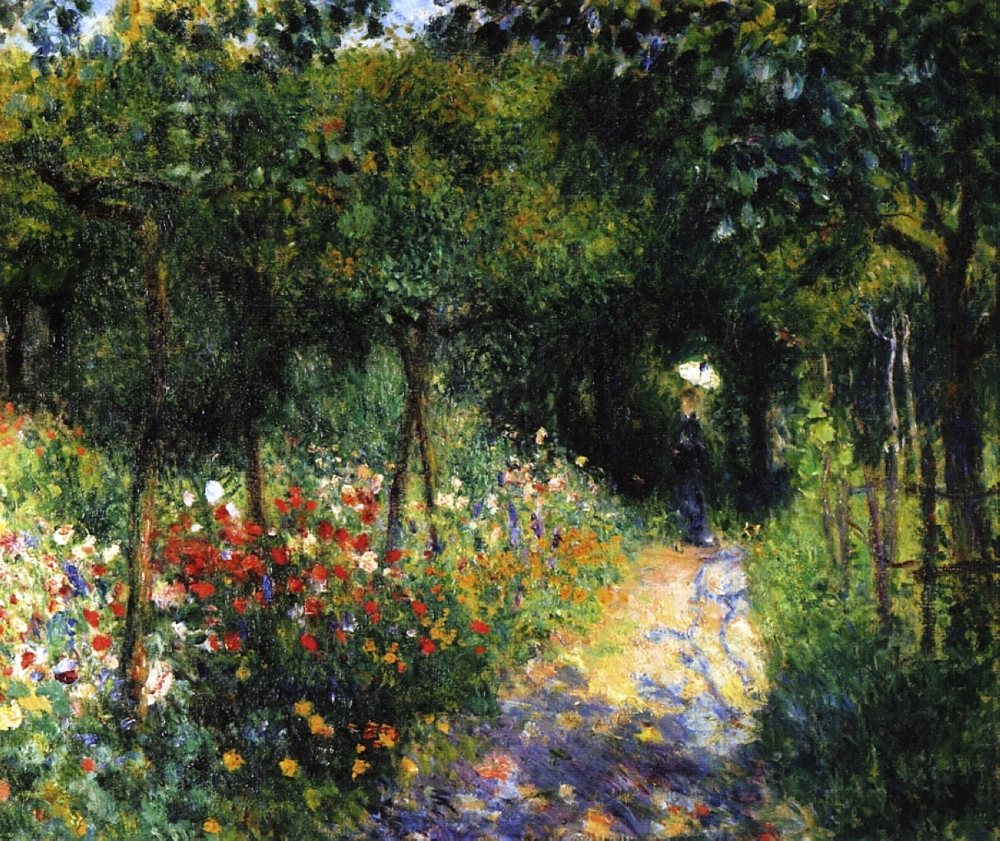

> ⚠️ 与莫奈《[[花园里的女人 Women in the Garden]]》(1866) 同名近义但属不同作品：本作为雷诺阿约 1890 年作品，单数女子、风景化构图；莫奈那幅是 1866 年的 205×260 cm 大画、复数女子。中文标题字序也不同（"女人在花园里" vs "花园里的女人"）。

## 基本信息

- 作者：[[雷诺阿 Pierre-Auguste Renoir]]
- 创作年代：约 1890
- 材质：布面油画 (*not from wiki*)
- 尺寸：年代不详 (*not from wiki*)
- 现存地：(*not from wiki*) 私人收藏 / 多地巡展记录

## 画面与技法

043 顾衡用本作展示雷诺阿"画风景时也能做到很好的平衡——**在忠实于印象派技法的同时，又能表现出很好的结构感和整体感**。在这一点上，我认为他是超过莫奈的"。

与 1880s 后期雷诺阿"安格尔时期"的转向呼应：人物形体由清晰素描勾勒，但环境采用印象派细碎小笔触和明亮调子——这是雷诺阿"两头不得罪"调和路线在风景画上的体现。

## 历史背景 (*not from wiki*)

约 1890 年。雷诺阿此时已经历 1881 意大利之行 (见拉斐尔后"我的印象派走到尽头"的自我宣告) + 安格尔主义阶段，回到一种**结构与色彩并重**的折衷成熟期。

## 图片清单

| 编号 | 出自 | 描述 |
|---|---|---|
| 01 | [[043｜雷诺阿：妥协如何造就大师？]] | 全图，单一女子置身花园 |

## 出现在

- [[043｜雷诺阿：妥协如何造就大师？]]
