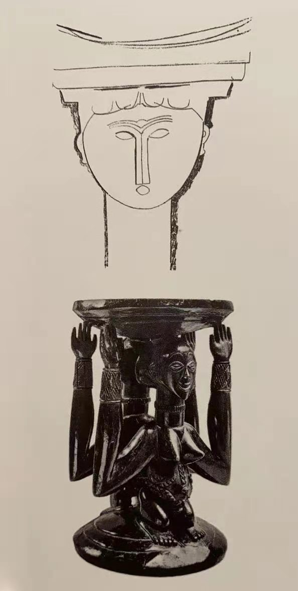

## 基本信息

- 作者：[[莫迪里阿尼 Amedeo Modigliani]]
- 创作年代：约 1909
- 材质：纸上铅笔 / 蜡笔草图 (*not from wiki*)
- 尺寸：(*未知*)
- 现存地：(*未知；莫迪里阿尼一生留下众多此类草图，散布欧美多家美术馆*) (*not from wiki*)

## 画面与技法

[[莫迪里阿尼 Amedeo Modigliani]] 1909 年为雕塑《女像柱头像》(Caryatid) 所作的**草稿**。女像柱 (希腊语 καρυάτις) = 古希腊建筑中**以女性立像替代柱子**的承重元素（雅典卫城伊瑞克提翁神庙最著名）。

莫迪里阿尼为这个雕塑题材画了大量草图：拉长的脖子、长鼻、**关节脱臼般的弧形姿势**——这些后来都被原封不动地搬到了油画肖像中。顾衡 078 指出 [[蓬巴杜夫人 (莫迪里阿尼) Madame Pompadour]] **显然来自这批草图**。

## 历史背景 (*not from wiki*)

女像柱实际雕塑作品莫迪里阿尼从未完成（仅留下数件半成品 + 数十张草图），但他借此**研究并固化了自己的人物程式**——这一过程比成品本身更重要。

## 图片清单

| 编号 | 出自 | 描述 |
|---|---|---|
| 01 | [[078｜莫迪里阿尼：画中女子为什么让人一眼难忘？]] | 草稿与雕塑残件 |

## 出现在

- [[078｜莫迪里阿尼：画中女子为什么让人一眼难忘？]]
