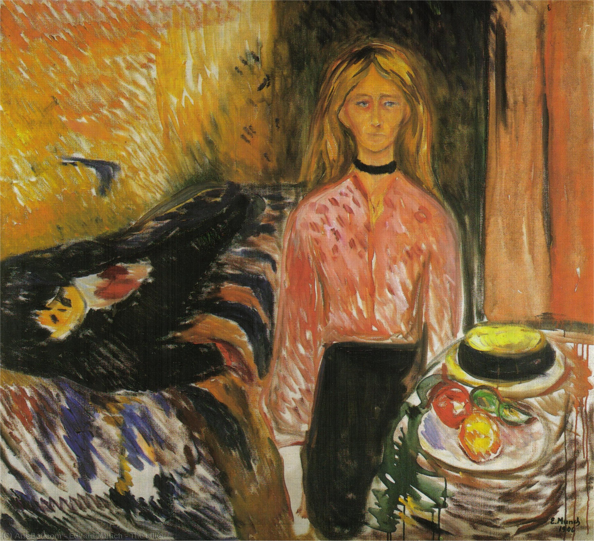

## 基本信息

- 作者：[[爱德华·蒙克 Edvard Munch]]
- 创作年代：1906
- 材质：布面油画 (*not from wiki*)
- 尺寸：约 70 × 100 cm (*not from wiki*)
- 现存地：奥斯陆 蒙克博物馆 Munch Museum, Oslo (*not from wiki*)

## 画面与技法

顾衡 [[071｜蒙克2：为什么他是表现主义之父？]] 解读：

- 蒙克与 [[图拉·拉尔森 Tulla Larsen]] 1902 年枪伤事件之后产生**被害妄想**——多年后画此作直接**指责图拉**。
- 属蒙克 [[表现主义 Expressionism]] 时期、以"**女人都是坏东西**"为起点、由 [[图拉·拉尔森 Tulla Larsen]] 事件加固的系列作品。

## 历史背景 (*not from wiki*)

亦译《女谋杀者》《杀人女》。蒙克 1906 年起反复用"赤色 / 暗调"色块构造心理压迫氛围，此为其表现主义成熟期标志之一。

## 图片清单

| 编号 | 出自 | 描述 |
|---|---|---|
| 01 | [[071｜蒙克2：为什么他是表现主义之父？]] | 女凶手与受害者，红色调 |

## 出现在

- [[071｜蒙克2：为什么他是表现主义之父？]]
