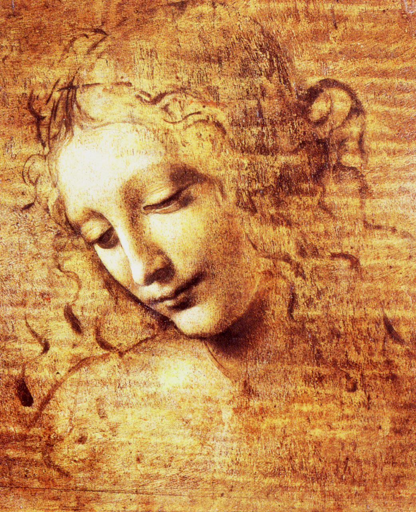

## 基本信息

- 作者：[[达·芬奇 Leonardo da Vinci]]
- 创作年代：约 1508 (顾衡引；学界主流认 c.1500-08，本作常被识别为 *La Scapigliata* (蓬乱头发的女人)) (*not from wiki*)
- 材质：木板赭石、油彩、白颜料 (oil, earth, and white lead on poplar)；近乎素描状态 (*not from wiki*)
- 尺寸：24.7 × 21 cm (*not from wiki*)
- 现存地：意大利帕尔马国家美术馆 (Galleria Nazionale di Parma) (*not from wiki*)

## 画面与技法

少女低首垂目、披散长发，**面容已经完成但头发部分仅以速写笔触表达**——这种"未完成感"反而让作品成为达·芬奇方法论的最佳示范：

- **没有一根线条**——形体完全由色调明暗的连续过渡塑造；
- **从素描阶段起就用阴影和反光来塑造形体**，而不是先勾轮廓再上色——这是达·芬奇相对其他画家的核心区别；
- 嘴角、眼角的微妙过渡显示 [[晕涂法 Sfumato]] 的成熟技法。

阿尔贝蒂："**在绘画中不应该看得到线条。**" 达·芬奇走得更远："**在大自然中也没有线条**——我们的眼睛所看见的，不过是反光和阴影，是色调明暗的变化。"

## 历史背景

(*not from wiki*) 归属与年代有争议；通常视为达·芬奇晚期典型未完成作。1826 起入帕尔马国美。

## 图片清单

| 编号 | 出自 | 描述 |
|---|---|---|
| 01 | [[010｜达芬奇：他为什么一生抑郁不得志？]] | 整体图 |

## 出现在

- [[010｜达芬奇：他为什么一生抑郁不得志？]]
