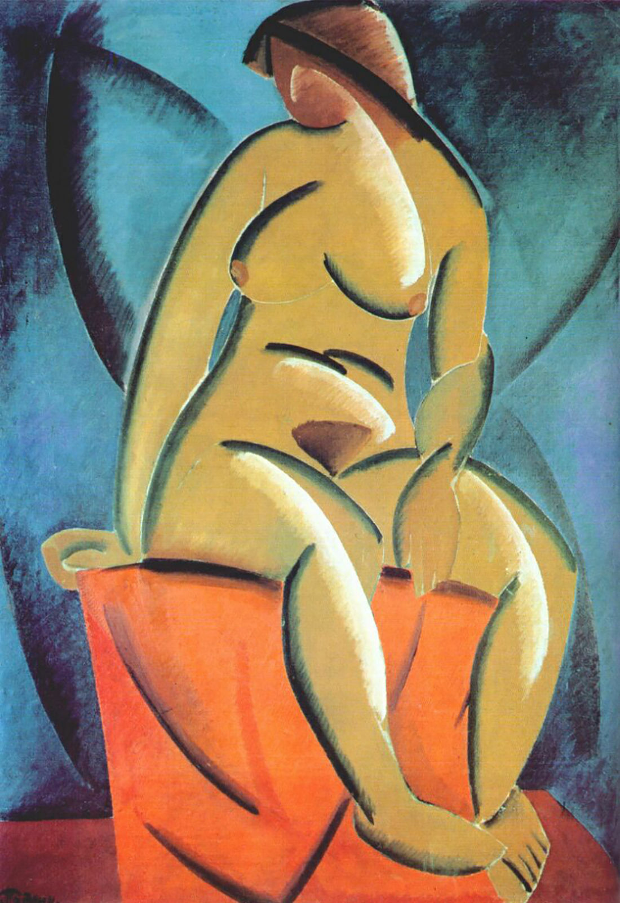

## 基本信息

- 作者：[[塔特林 Vladimir Tatlin]]
- 创作年代：1913
- 材质：布面油画 (*not from wiki*)
- 尺寸：年代不详 (*not from wiki*)
- 现存地：俄罗斯博物馆，圣彼得堡 (*not from wiki*)

## 画面与技法

[[塔特林 Vladimir Tatlin]] 1913 年作品，与 [[水手 (塔特林) The Sailor (Self Portrait)]] 同属塔特林早期"立体主义 + 俄罗斯民俗"的混搭阶段。

顾衡 086 把它与 [[收割者 (马列维奇) Reaper]] 同年作品对比：塔特林**保留了更多的写实主义元素**，走得没有 [[马列维奇 Kazimir Malevich]] 那么远。

## 图片清单

| 编号 | 出自 | 描述 |
|---|---|---|
| 01 | [[086｜塔特林：什么是构成主义？]] | 全画 |

## 出现在

- [[086｜塔特林：什么是构成主义？]]
