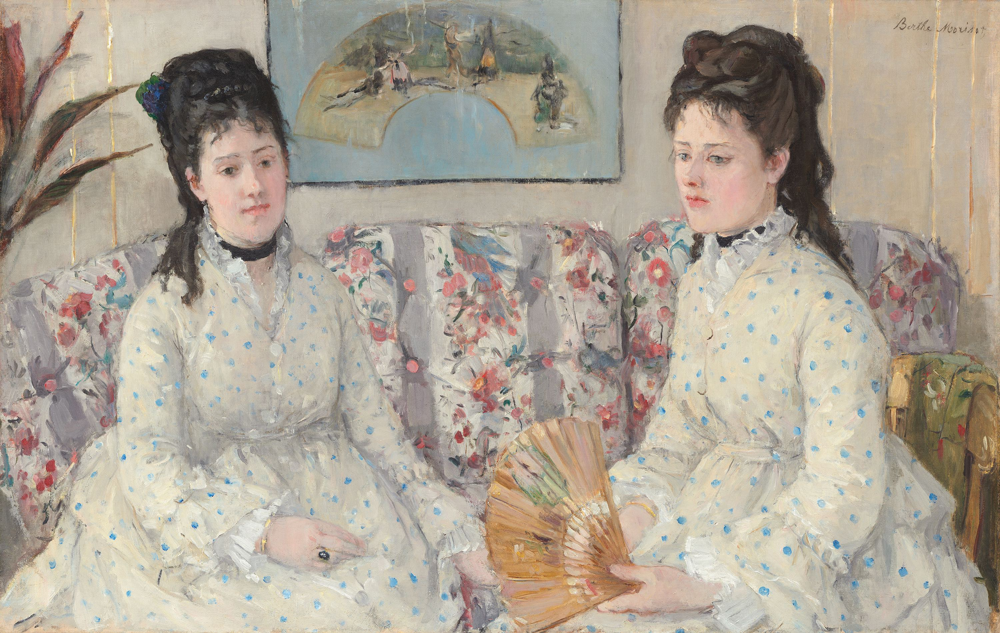

## 基本信息

- 作者：[[莫利索 Berthe Morisot]]
- 创作年代：1869
- 材质：布面油画 (*not from wiki*)
- 尺寸：52.1 × 81.3 cm (*not from wiki*)
- 现存地：(*not from wiki*) 华盛顿国家美术馆 National Gallery of Art

## 画面与技法

莫利索画其妹妹 Edma 与另一位女性的双人坐像——身后悬挂的**扇画**正是 045 重点：那是德加送给莫利索的礼物，画的是法国文人 [[阿尔弗雷德·德·缪塞 Alfred de Musset]] 弹吉他唱小夜曲——**德加用扇画作为求爱手段**。

045 顾衡明示：莫利索没有读懂这个暗示——"莫利索还真就不知道。莫利索爱的是 [[马奈 Édouard Manet]]，可是后来嫁给了他的弟弟"。

## 历史背景

(*not from wiki*) 1869 年莫利索 28 岁。这幅画是她进入 [[印象派 Impressionism]] 之前、风格仍偏古典的过渡期作品。

## 图片清单

| 编号 | 出自 | 描述 |
|---|---|---|
| 01 | [[045｜德加：为什么印象派以他结束？]] | 姐妹坐像 + 身后德加赠扇画 |

## 出现在

- [[045｜德加：为什么印象派以他结束？]]
