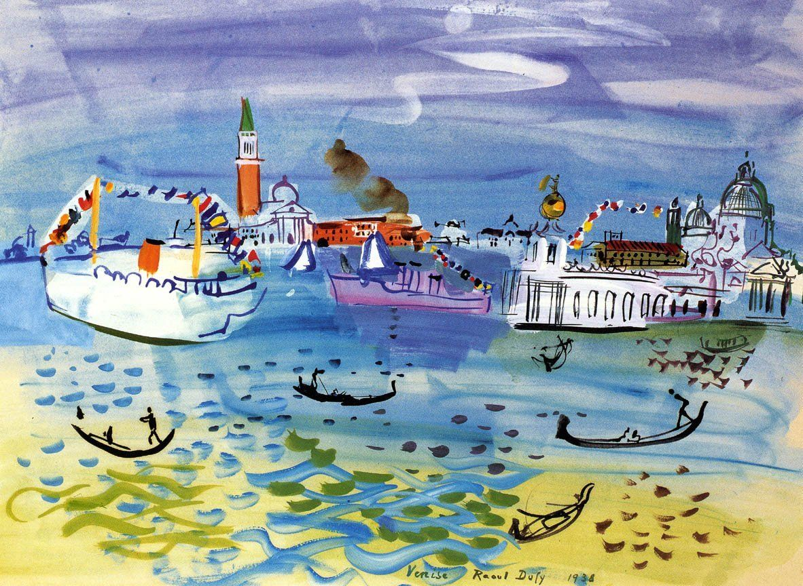

## 基本信息

- 作者：[[杜菲 Raoul Dufy]]
- 创作年代：1938
- 材质：油彩，画布 (*not from wiki*)
- 现存地：(*not from wiki*)

## 画面与技法

[[杜菲 Raoul Dufy]] 1938 年威尼斯主题作品。La Dogana 是威尼斯海关大楼 (Punta della Dogana)，位于大运河与朱代卡运河交汇处，是威尼斯著名地标。

延续杜菲的两层叠加法——明快薄涂色域 + 简率装饰性线条；与 [[考斯的帆船比赛 Regatta at Cowes]] 同样体现"**色与形分离独立**"的杜菲式画风。

## 历史背景 (*not from wiki*)

- 1938 年 [[杜菲 Raoul Dufy]] 在欧洲多个港口城市写生；威尼斯是他多次描绘的对象。
- 同年欧洲战云密布——杜菲坚持轻盈装饰风格，与时局形成反差。

## 图片清单

| 编号 | 出自 | 描述 |
|---|---|---|
| 01 | [[063｜野兽派，除了马蒂斯还能谈什么？]] | 整幅画面 |

## 出现在

- [[063｜野兽派，除了马蒂斯还能谈什么？]] —— 顾衡"多放几幅杜菲"5 件之一
