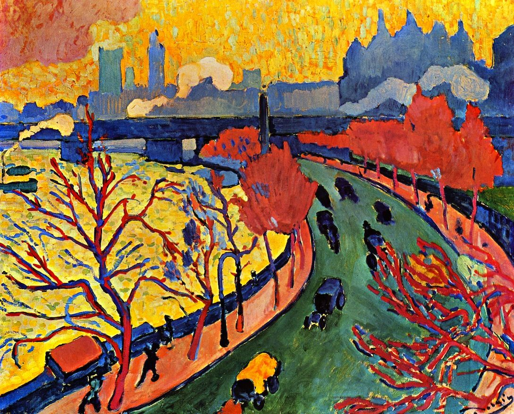

## 基本信息

- 作者：[[德朗 André Derain]]
- 创作年代：1906
- 材质：油彩，画布 (*not from wiki*)
- 现存地：(*not from wiki*)

## 画面与技法

[[德朗 André Derain]] 1906 年伦敦系列。与 [[海德公园 Hyde Park]] 同组——顾衡 063 用这一对作品论证 [[德朗 André Derain]] **塞尚式 [[分节 (塞尚) Passage|分节]] (passage)** 的延续性：即使到了 [[野兽派 Fauvism]] 时期，德朗仍保留 [[塞尚 Paul Cézanne]] 式的分节构图——色块以平行笔触衔接、可见的过渡区，而不像 [[马蒂斯 Henri Matisse]] 那样彻底放弃纵深。

## 历史背景 (*not from wiki*)

- 1905–1906 [[德朗 André Derain]] 受画商沃拉尔 (Ambroise Vollard) 委托赴伦敦创作约 30 幅泰晤士河、伦敦桥系列，与 [[莫奈 Claude Monet]] 的伦敦 [[组画 Series Paintings]] 形成新一代回应。
- 顾衡 063：本作呈现 "塞尚式的'分节'性"——表明 [[德朗 André Derain]] **革命没那么彻底**。

## 图片清单

| 编号 | 出自 | 描述 |
|---|---|---|
| 01 | [[063｜野兽派，除了马蒂斯还能谈什么？]] | 整幅画面——1906 伦敦组画 |

## 出现在

- [[063｜野兽派，除了马蒂斯还能谈什么？]] —— 作为德朗塞尚式分节延续性的样本
