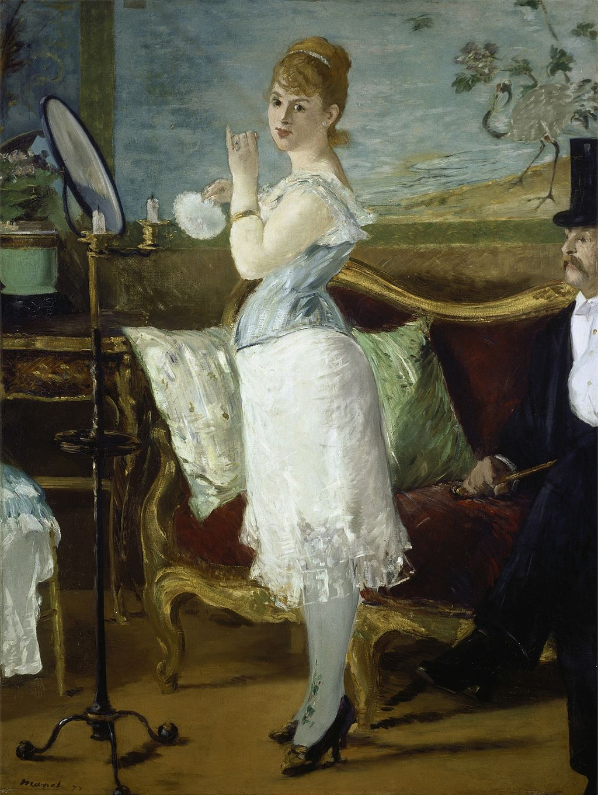

## 基本信息

- 作者：[[马奈 Édouard Manet]]
- 创作年代：1877
- 材质：油彩，画布 (*not from wiki*)
- 尺寸：154 × 115 cm (*not from wiki*)
- 现存地：汉堡美术馆 Hamburger Kunsthalle (*not from wiki*)

## 画面与技法

[[马奈 Édouard Manet]] 描绘巴黎名妓 Nana 化妆的场景——半穿着、面对镜子、回眸看观者；画面右侧坐着戴礼帽的男客。题名直接取自左拉小说《娜娜》的主角，是 [[现代性 Modernité]] 论述里**妓女母题**的又一关键例证。1877 年因"伤风败俗"被沙龙拒绝 (*not from wiki*)。

## 历史背景 (*not from wiki*)

模特是当时著名交际花 Henriette Hauser。1877 年送沙龙被拒后，马奈把画挂在 Capucines 街道一家商店橱窗，引来巴黎人围观——成为艺术家越过沙龙、直接借商业橱窗发表作品的先锋案例，与本课强调的 [[画廊与经纪人体系 Gallery and Dealer System]] 兴起同步。

## 图片清单

| 编号 | 出自 | 描述 |
|---|---|---|
| 01 | [[038｜马奈1：为什么他是西方现代绘画的鼻祖？]] | 全图 |

## 出现在

- [[038｜马奈1：为什么他是西方现代绘画的鼻祖？]]
